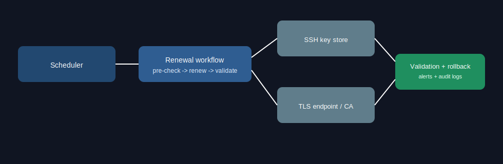

# ssh-ssl-auto-renew

Design and implementation workspace for automated SSH key and TLS certificate renewal with validation, auditability, and rollback safety.

## Problem
Manual SSH/TLS renewal is error-prone and can cause outages, trust-chain failures, or expired credentials in production if not validated end-to-end.

## Security Context
- Reduces key/certificate expiration risk.
- Enforces validation checks before and after renewal.
- Supports rollback strategy to prevent prolonged downtime.
- Aligns with secure operations and incident-response readiness.

Failure-mode and renewal safety notes:
- Never overwrite active credentials without backup snapshots.
- Validate new keys/certs against target services before cutover.
- Trigger alerting on validation failure and automatically revert.
- Record all renewal actions for audit and compliance review.

## Architecture/Flow


Planned flow:
1. Scheduler initiates renewal window.
2. Pre-check confirms expiry threshold and service readiness.
3. Renewal process requests and installs new credentials.
4. Post-renew validation checks handshake/login behavior.
5. Rollback + alerting triggers on validation failure.

## Setup
```bash
git clone git@github.com:jaskaranhundal/ssh-ssl-auto-renew.git
cd ssh-ssl-auto-renew
```

Planned setup targets:
- Linux cron/systemd timer
- OpenSSL/ACME tooling
- SSH key generation and secure distribution steps

## Example Output
```text
INFO Renewal window started
INFO Certificate expires in 9 days, renewal required
INFO New certificate installed in staging path
INFO Validation succeeded for service endpoint
INFO Rotation completed and audit log persisted
```

## Limitations
- Current repository is a bootstrap with design-first documentation.
- Renewal scripts and automated tests are still being built.
- Environment-specific secret distribution is not yet implemented.

## Roadmap
- Add production-ready renewal scripts for SSH and TLS.
- Add canary validation before full deployment.
- Add secret manager integration and encrypted key handling.
- Add CI checks for expiry thresholds and policy enforcement.
