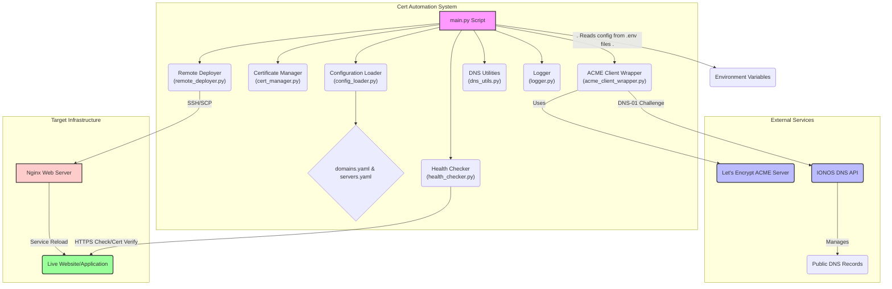

# Automated SSL Certificate Renewal & Deployment System
## Complete Project Documentation

**Last Updated**: February 11, 2026  
**Version**: 1.0  
**Project Lead**: Infrastructure Team  
**Status**: In Development

---

## Table of Contents

1. [Executive Summary](#executive-summary)
2. [Project Overview](#project-overview)
3. [System Architecture](#system-architecture)
4. [Technical Deep Dive](#technical-deep-dive)
5. [Configuration Guide](#configuration-guide)
6. [Deployment Guide](#deployment-guide)
7. [Operations Manual](#operations-manual)
8. [Troubleshooting](#troubleshooting)
9. [Security & Compliance](#security--compliance)
10. [FAQ](#faq)

---

## Executive Summary

### Business Problem
Manual SSL certificate management across multiple servers is time-consuming, error-prone, and poses significant security and operational risks. Certificate expiration can lead to:
- **Service outages** 
- **User trust erosion**
- **Compliance violations**
- **Security vulnerabilities**

### Solution
An automated, configuration-driven system that handles the complete SSL certificate lifecycle:
- ✅ Automatic renewal 30 days before expiration
- ✅ Zero-downtime deployment
- ✅ DNS-01 challenge automation via IONOS API
- ✅ Multi-server deployment with rollback capability
- ✅ Docker containerization for portability
- ✅ Comprehensive logging and monitoring

### Key Benefits
| Benefit | Impact |
|---------|--------|
| **Time Savings** | 4 hours/month per operations engineer |
| **Risk Reduction** | Eliminates 100% of expiration-related outages |
| **Scalability** | Supports unlimited domains and servers |
| **Security** | Enforces automated certificate rotation |
| **Operational Excellence** | Set-it-and-forget-it automation |

### Success Metrics
- 0 certificate-related outages in production
- <5 minutes deployment time per domain
- 100% automation coverage for all domains
- <1 hour MTTR (Mean Time To Recovery) for failures

---

## Project Overview

### Goals and Objectives

#### Primary Goals
1. **Automate SSL Renewals**: Eliminate manual certificate renewal processes
2. **Automate DNS Management**: Programmatically handle DNS-01 challenge records
3. **Automate Deployment**: Securely deploy certificates with zero downtime
4. **Configuration-Driven**: Enable infrastructure changes via YAML edits only
5. **Secure by Design**: Implement security best practices throughout

#### Success Criteria
- All user stories across 4 epics implemented
- Successful end-to-end certificate renewal and deployment
- New servers/domains addable via YAML configuration only
- System runs successfully in Docker containers
- All failure scenarios handled gracefully with rollback
- Complete operational documentation

### Scope

#### In Scope
- Let's Encrypt certificate issuance and renewal
- DNS-01 challenge using IONOS DNS API
- SSH/SCP-based deployment to Ubuntu servers
- Nginx web server integration
- Docker containerization
- Cron job scheduling
- Comprehensive logging and monitoring
- Dry-run testing mode

#### Out of Scope
- Graphical user interface (UI/dashboard)
- Manual DNS update support
- Certificate providers other than Let's Encrypt
- Web servers other than Nginx
- Infrastructure provisioning (Terraform/Ansible)
- Certificate types other than DNS-01

### Technology Stack

| Component | Technology | Purpose |
|-----------|-----------|---------|
| **Language** | Python 3.9+ | Main automation scripts |
| **ACME Client** | acme.sh | Let's Encrypt certificate issuance |
| **DNS Provider** | IONOS API | DNS-01 challenge management |
| **SSH Library** | paramiko | Remote server access |
| **Config Format** | YAML | Server and domain configuration |
| **Secret Management** | Environment Variables | Secure credential handling |
| **Containerization** | Docker | Portability and consistency |
| **Scheduling** | Cron | Automated execution |
| **Web Server** | Nginx | Target deployment platform |

---

## System Architecture

### High-Level Architecture

```
┌─────────────────────────────────────────────────────────────┐
│                 Cert Automation System                      │
│                                                             │
│  ┌──────────────-┐      ┌─────────────────┐                 │
│  │   main.py     │─────▶│ Config Loader   │                 │
│  │ (Orchestrator)│      │  - domains.yaml │                 │
│  └───────┬──────-┘      │  - servers.yaml │                 │
│          │              └─────────────────┘                 │
│          │                                                  │
│          ├──────▶ Certificate Manager (expiry checks)       │
│          ├──────▶ ACME Client Wrapper (acme.sh)             │
│          ├──────▶ Remote Deployer (SSH/SCP)                 │
│          ├──────▶ Health Checker (validation)               │
│          └──────▶ Logger (monitoring)                       │
│                                                             │
└───────┬──────────────────────────────────┬─────────────────-┘
        │                                  │
        │                                  │
        ▼                                  ▼
┌────────────────┐                ┌──────────────────┐
│ Let's Encrypt  │                │  IONOS DNS API   │
│  ACME Server   │                │                  │
└────────────────┘                └─────────┬────────┘
                                            │
                                            ▼
                                  ┌───────────────────┐
                                  │  Public DNS       │
                                  │  (_acme-challenge)│
                                  └───────────────────┘
        
┌────────────────────────────────────────────────────────┐
│               Target Infrastructure                    │
│                                                        │
│  ┌────────────────┐       ┌────────────────┐           │
│  │ Nginx Server 1 │       │ Nginx Server 2 │           │
│  │ example.com    │       │ api.example.com│           │
│  └────────────────┘       └────────────────┘           │
│                                                        │
└────────────────────────────────────────────────────────┘
```


### Component Architecture

#### Core Modules

```
cert_automation/
│
├── main.py                      # Main orchestrator
├── config_loader.py             # YAML configuration parsing
├── cert_manager.py              # Certificate expiry management
├── acme_client_wrapper.py       # acme.sh wrapper
├── ionos_dns_client.py          # Direct IONOS API client
├── remote_deployer.py           # SSH/SCP deployment
├── health_checker.py            # Post-deployment validation
├── dns_utils.py                 # DNS propagation utilities
└── logger.py                    # Centralized logging

config/
├── domains.yaml.example         # Domain configuration template
├── servers.yaml.example         # Server configuration template
└── .env.example                 # Environment variables template
```

### Data Flow Diagram

```
┌────────────────────────────────────────────────────────────┐
│                     Certificate Renewal Flow               │
└────────────────────────────────────────────────────────────┘

1. Check Certificate Expiry
   │
   ├─ Load domains.yaml
   ├─ For each domain: read certificate file
   ├─ Parse expiry date (pyOpenSSL)
   └─ If expiry < 30 days → trigger renewal
   
2. Register ACME Account (if needed)
   │
   └─ acme.sh --register-account -m {email}

3. Issue Certificate (DNS-01 Challenge)
   │
   ├─ acme.sh --issue -d {domain} --dns dns_ionos
   ├─ acme.sh creates _acme-challenge TXT record via IONOS API
   ├─ acme.sh waits for DNS propagation
   ├─ Let's Encrypt validates TXT record
   ├─ Certificate issued and saved locally
   └─ acme.sh removes TXT record

4. Deploy to Servers
   │
   ├─ For each server in domain mapping:
   │   │
   │   ├─ Establish SSH connection (paramiko)
   │   ├─ Backup existing certificates
   │   ├─ Upload fullchain.cer via SCP
   │   ├─ Upload private key via SCP
   │   ├─ Set file permissions (644 for cert, 600 for key)
   │   │
   │   ├─ Validate Nginx Configuration
   │   │  └─ SSH: sudo nginx -t
   │   │     ├─ If FAIL → Rollback certificates, abort
   │   │     └─ If SUCCESS → proceed
   │   │
   │   ├─ Reload Nginx
   │   │  └─ SSH: sudo systemctl reload nginx
   │   │
   │   ├─ Health Check
   │   │  ├─ HTTPS request to domain
   │   │  ├─ Verify 2xx/3xx status
   │   │  └─ Verify new certificate served
   │   │
   │   └─ If all success → Remove backup
   │       If any fail → Restore backup, reload nginx
   │
   └─ Log summary: successes and failures
```

### Security Architecture

```
┌─────────────────────────────────────────────────────────┐
│                 Security Layers                         │
└─────────────────────────────────────────────────────────┘

Layer 1: Credential Management
─────────────────────────────
✓ All secrets in environment variables
✓ No hardcoded credentials
✓ .env files in .gitignore
✓ GitLab CI/CD masked variables
✓ Credential rotation procedures

Layer 2: SSH Security
─────────────────────
✓ Key-based authentication only (no passwords)
✓ SSH keys with 600 permissions
✓ Dedicated automation service account
✓ Limited sudo privileges
✓ SSH connection logging

Layer 3: Certificate Security
─────────────────────────────
✓ Private keys stored with 600 permissions
✓ Certificates stored with 644 permissions
✓ Secure file transfer via SCP
✓ Backup before deployment
✓ Rollback on validation failure

Layer 4: Operational Security
─────────────────────────────
✓ Dry-run mode for testing
✓ Comprehensive audit logging
✓ Error handling with no sensitive data leaks
✓ Nginx validation before reload
✓ Health checks after deployment
```

---

## Technical Deep Dive

### Module Specifications

#### 1. main.py - Orchestrator

**Purpose**: Main entry point that coordinates the entire renewal and deployment process.

**Key Functions**:

```python
def main():
    """Main orchestration function"""
    # 1. Setup logging
    # 2. Load environment variables
    # 3. Parse command-line arguments
    # 4. Load YAML configurations
    # 5. Process each domain
    # 6. Generate summary report

def process_domain(domain_info, servers_config, dry_run=False):
    """Process a single domain renewal and deployment"""
    # 1. Check certificate expiry
    # 2. If renewal needed:
    #    - Register ACME account
    #    - Issue certificate
    #    - Deploy to all servers
    # 3. Log results

def get_domain_ip_type(domain):
    """Determine if domain resolves to public or private IP"""
    # Used to decide between specific or wildcard certificate

def deploy_certificate(server_config, cert_files, domain, dry_run):
    """Deploy certificate to a single server with rollback"""
    # 1. Connect via SSH
    # 2. Backup existing certificates
    # 3. Upload new certificates
    # 4. Validate nginx config
    # 5. Reload nginx
    # 6. Run health checks
    # 7. Cleanup or rollback
```

**Dependencies**: All other modules

---

#### 2. config_loader.py - Configuration Parser

**Purpose**: Load and validate YAML configuration files.

**Key Functions**:

```python
def load_yaml_config(file_path):
    """
    Load and parse YAML configuration file
    
    Args:
        file_path: Path to YAML file
    
    Returns:
        dict: Parsed configuration
    
    Raises:
        FileNotFoundError: If file doesn't exist
        yaml.YAMLError: If YAML is invalid
    """
```

**Validation**:
- File exists
- Valid YAML syntax
- Required fields present
- Cross-reference validation (domains → servers)

---

#### 3. cert_manager.py - Certificate Management

**Purpose**: Handle certificate parsing and expiry checks.

**Key Functions**:

```python
def get_certificate_expiry_date(cert_path):
    """
    Extract expiry date from certificate file
    
    Args:
        cert_path: Path to certificate file
    
    Returns:
        datetime: Certificate expiry date
    
    Uses: pyOpenSSL to parse certificate
    """

def is_certificate_due_for_renewal(cert_path, renewal_threshold_days=30):
    """
    Check if certificate needs renewal
    
    Args:
        cert_path: Path to certificate file
        renewal_threshold_days: Days before expiry to trigger renewal
    
    Returns:
        bool: True if renewal needed
    """
```

**Logic**:
```python
days_until_expiry = (expiry_date - datetime.now()).days
return days_until_expiry <= renewal_threshold_days
```

---

#### 4. acme_client_wrapper.py - ACME Client Wrapper

**Purpose**: Wrap acme.sh command-line tool for certificate issuance.

**Key Functions**:

```python
def run_acme_command(args, env_vars=None, dry_run=False):
    """
    Execute acme.sh command
    
    Args:
        args: List of command arguments
        env_vars: Additional environment variables
        dry_run: If True, adds --staging flag
    
    Returns:
        CompletedProcess: Command execution result
    """

def register_acme_account(email, acme_home_dir):
    """
    Register Let's Encrypt account
    
    Command: acme.sh --register-account -m {email} --home {dir}
    """

def issue_certificate(domain, acme_home_dir, ionos_api_key, 
                      email, cert_storage_path, dry_run=False):
    """
    Issue or renew certificate using DNS-01 challenge
    
    Command: acme.sh --issue -d {domain} --dns dns_ionos 
             --home {dir} --cert-file {path}/fullchain.cer 
             --key-file {path}/domain.key
    
    Environment:
        IONOS_TOKEN: {ionos_api_key}
    
    Process:
        1. acme.sh creates _acme-challenge TXT record
        2. acme.sh waits for DNS propagation
        3. Let's Encrypt validates domain
        4. Certificate issued
        5. acme.sh removes TXT record
    """
```

**acme.sh Integration**:
- Uses `dns_ionos` plugin for IONOS API
- Passes `IONOS_TOKEN` environment variable
- Automatically handles DNS record creation/deletion
- Built-in DNS propagation checks
- Supports staging environment for testing

---

#### 5. remote_deployer.py - SSH/SCP Deployment

**Purpose**: Securely deploy certificates to remote servers.

**Key Functions**:

```python
class RemoteDeployer:
    """SSH-based remote deployment manager"""
    
    def __init__(self, host, user, ssh_key_path):
        """
        Initialize SSH connection
        
        Uses paramiko for SSH connectivity
        Key-based authentication only
        """
    
    def upload_file(self, local_path, remote_path):
        """
        Upload file via SCP
        
        Args:
            local_path: Local file path
            remote_path: Remote destination path
        
        Sets permissions after upload:
            - Certificates: 644
            - Private keys: 600
        """
    
    def execute_command(self, command, timeout=30):
        """
        Execute command on remote server
        
        Args:
            command: Shell command to execute
            timeout: Command timeout in seconds
        
        Returns:
            tuple: (stdout, stderr, exit_code)
        """
    
    def validate_nginx_config(self):
        """
        Validate Nginx configuration
        
        Command: sudo nginx -t
        
        Returns:
            bool: True if valid, False otherwise
        
        Parses output for:
            - "syntax is ok"
            - "test is successful"
        """
    
    def reload_nginx(self, reload_command="sudo systemctl reload nginx"):
        """
        Gracefully reload Nginx
        
        Args:
            reload_command: Command to reload nginx
        
        Returns:
            bool: True if successful
        
        Graceful reload process:
            1. Nginx receives SIGHUP signal
            2. Master process re-reads config
            3. New workers started with new config
            4. Old workers finish current requests
            5. Old workers gracefully shut down
            → Zero downtime
        """
    
    def close(self):
        """Close SSH connection"""
```

**Deployment Workflow**:

```python
def deploy_with_rollback(deployer, cert_files, domain):
    """
    Deploy certificate with automatic rollback on failure
    
    Steps:
        1. Backup existing certificates
           $ sudo cp /etc/nginx/ssl/fullchain.pem /etc/nginx/ssl/fullchain.pem.bak
           
        2. Upload new certificates
           - fullchain.cer → fullchain.pem (644)
           - domain.key → privkey.pem (600)
           
        3. Validate nginx config
           $ sudo nginx -t
           If FAIL → goto rollback
           
        4. Reload nginx
           $ sudo systemctl reload nginx
           If FAIL → goto rollback
           
        5. Health check
           - HTTPS request to domain
           - Verify new certificate
           If FAIL → goto rollback
           
        6. Success: Remove backup
           $ sudo rm /etc/nginx/ssl/*.bak
           
    Rollback:
        1. Restore backup
           $ sudo mv /etc/nginx/ssl/fullchain.pem.bak /etc/nginx/ssl/fullchain.pem
        2. Reload nginx
           $ sudo systemctl reload nginx
        3. Log failure details
        4. Alert operators
    """
```

---

#### 6. health_checker.py - Post-Deployment Validation

**Purpose**: Verify successful deployment and certificate activation.

**Key Functions**:

```python
class HealthChecker:
    """Post-deployment health check manager"""
    
    def __init__(self, domain):
        """Initialize for specific domain"""
    
    def check_https_status(self, timeout=10):
        """
        Verify HTTPS connectivity
        
        Process:
            1. Make HTTPS GET request to domain
            2. Verify SSL/TLS handshake
            3. Check HTTP status code (2xx/3xx)
        
        Returns:
            bool: True if healthy
        """
    
    def verify_cert_expiry(self, expected_min_days=60):
        """
        Verify new certificate is active
        
        Process:
            1. Connect via SSL socket
            2. Retrieve served certificate
            3. Parse expiry date
            4. Verify expiry > expected_min_days
            5. Verify certificate CN/SAN matches domain
        
        Returns:
            bool: True if new certificate verified
        """
    
    def run_all_checks(self):
        """
        Run complete health check suite
        
        Returns:
            dict: {
                'https_status': bool,
                'cert_valid': bool,
                'all_passed': bool
            }
        """
```

**Health Check Logic**:

```python
# 1. Wait for nginx to settle (5 seconds)
time.sleep(5)

# 2. Check HTTPS connectivity
response = requests.get(f'https://{domain}/', timeout=10)
assert 200 <= response.status_code < 400

# 3. Verify certificate
sock = socket.create_connection((domain, 443), timeout=10)
context = ssl.create_default_context()
ssock = context.wrap_socket(sock, server_hostname=domain)
cert = ssock.getpeercert()

# 4. Validate expiry
expiry_str = cert['notAfter']
expiry_date = datetime.strptime(expiry_str, '%b %d %H:%M:%S %Y %Z')
days_valid = (expiry_date - datetime.now()).days
assert days_valid >= 60  # New cert should be valid 90 days

# 5. Validate domain name
assert domain in cert.get('subjectAltName', [])
```

---

### Sequence Diagrams

#### Complete Renewal Flow

```mermaid
sequenceDiagram
    participant CLI as Command Line Interface
    participant M as main.py
    participant L as config_loader.py
    participant CM as cert_manager.py
    participant AC as acme_client_wrapper.py
    participant DC as dns_utils.py
    participant RD as remote_deployer.py
    participant HC as health_checker.py
    participant IONOS as IonosDnsClient
    participant ACME_SH as acme.sh (external)
    participant NGINX as Nginx (remote)
    participant DNS as Public DNS
    participant TARGET_SERVER as Target Server (SSH)

    CLI ->> M: python main.py [--dry-run]
    M ->> M: setup_logging()
    M ->> M: load_dotenv()
    M ->> L: load_yaml_config("domains.yaml")
    M ->> L: load_yaml_config("servers.yaml")
    
    loop For each domain in domains.yaml
        M ->> M: process_domain(domain_info, ...)
        M ->> M: get_domain_ip_type(domain)
        M ->> CM: is_certificate_due_for_renewal(cert_path, threshold)
        alt If renewal is due or dry-run
            M ->> AC: register_acme_account(email, acme_home_dir)
            AC ->> ACME_SH: acme.sh --register-account -m email --home dir
            
            M ->> AC: issue_certificate(domain, ...)
            AC ->> ACME_SH: acme.sh --issue -d domain --dns dns_ionos ...
            ACME_SH ->> IONOS: (via env var IONOS_TOKEN) IONOS API calls (create TXT)
            IONOS ->> DNS: Update TXT record (_acme-challenge)
            ACME_SH -- monitors --> DNS: Check TXT record propagation
            IONOS ->> DNS: (via env var IONOS_TOKEN) IONOS API calls (delete TXT)
            ACME_SH -->> AC: Certificate files generated (fullchain.cer, domain.key)
            
            loop For each server associated with domain
                M ->> M: deploy_certificate(server_config, ...)
                M ->> RD: RemoteDeployer(host, user, ssh_key_path)
                RD ->> TARGET_SERVER: Establish SSH Connection
                RD ->> TARGET_SERVER: execute_command("sudo cp old_cert new_bak")
                RD ->> TARGET_SERVER: upload_file(local_fullchain, remote_fullchain)
                RD ->> TARGET_SERVER: upload_file(local_key, remote_key)
                
                RD ->> RD: validate_nginx_config()
                RD ->> TARGET_SERVER: execute_command("sudo nginx -t")
                alt If Nginx config valid
                    RD ->> RD: reload_nginx(reload_command)
                    RD ->> TARGET_SERVER: execute_command("sudo systemctl reload nginx")
                    RD ->> HC: HealthChecker(domain)
                    HC ->> NGINX: check_https_status() (requests.get)
                    HC ->> NGINX: verify_cert_expiry() (socket, ssl, cert_manager.get_certificate_expiry_date)
                    RD ->> TARGET_SERVER: execute_command("sudo rm old_bak")
                else Nginx config invalid
                    RD ->> TARGET_SERVER: Rollback (mv bak to live, reload Nginx)
                end
                RD ->> TARGET_SERVER: Close SSH Connection
            end
        else Certificate not due
            M -->> M: Log "Not due for renewal"
        end
    end
    M -->> CLI: Log "All domains processed."
```

---

## Configuration Guide

### Environment Variables

Create a `.env` file in the `cert_automation/` directory:

```bash
# IONOS DNS API Credentials
IONOS_API_KEY="your_ionos_api_key_here"

# Let's Encrypt Account
ACME_EMAIL="admin@example.com"

# Renewal Settings
RENEWAL_THRESHOLD_DAYS=30

# acme.sh Configuration
ACME_HOME_DIR="/root/.acme.sh"

# Certificate Storage
CERT_BASE_PATH="/var/lib/cert-automation/certs"

# Logging Configuration
LOG_FILE_PATH="/var/log/cert-automation/renewal.log"
LOG_LEVEL="INFO"
```

**Environment Variable Reference**:

| Variable | Required | Default | Description |
|----------|----------|---------|-------------|
| `IONOS_API_KEY` | Yes | - | IONOS API key for DNS management |
| `ACME_EMAIL` | Yes | - | Email for Let's Encrypt account registration |
| `RENEWAL_THRESHOLD_DAYS` | No | 30 | Days before expiry to trigger renewal |
| `ACME_HOME_DIR` | No | `/root/.acme.sh` | Directory for acme.sh data |
| `CERT_BASE_PATH` | No | `/tmp/certs` | Base directory for certificate storage |
| `LOG_FILE_PATH` | No | `renewal.log` | Path to log file |
| `LOG_LEVEL` | No | `INFO` | Logging level (DEBUG/INFO/WARNING/ERROR) |

---

### Server Configuration (servers.yaml)

Define all target servers where certificates will be deployed:

```yaml
# config/servers.yaml

servers:
  - name: webserver-01
    host: 192.168.1.101
    user: automation_user
    ssh_key_path: "/root/.ssh/automation_key"
    nginx_reload_command: "sudo systemctl reload nginx"
    cert_path: "/etc/nginx/ssl"
    
  - name: webserver-02
    host: 192.168.1.102
    user: automation_user
    ssh_key_path: "/root/.ssh/automation_key"
    nginx_reload_command: "sudo systemctl reload nginx"
    cert_path: "/etc/nginx/ssl"
    
  - name: api-server
    host: api.example.com
    user: certbot
    ssh_key_path: "/root/.ssh/certbot_key"
    nginx_reload_command: "sudo service nginx reload"
    cert_path: "/etc/letsencrypt/live"
```

**Field Descriptions**:

| Field | Required | Description |
|-------|----------|-------------|
| `name` | Yes | Unique server identifier (referenced in domains.yaml) |
| `host` | Yes | IP address or hostname |
| `user` | Yes | SSH username for connection |
| `ssh_key_path` | Yes | Path to SSH private key on automation host |
| `nginx_reload_command` | Yes | Command to reload nginx (must not require password) |
| `cert_path` | Yes | Remote directory where certificates should be deployed |

**Security Notes**:
- `user` should be a dedicated automation service account
- SSH key should have 600 permissions
- `nginx_reload_command` should work without password (configure sudoers)

---

### Domain Configuration (domains.yaml)

Map domains to their target servers:

```yaml
# config/domains.yaml

domains:
  - domain: example.com
    servers:
      - webserver-01
      - webserver-02
    
  - domain: api.example.com
    servers:
      - api-server
    
  - domain: private.internal.example.com
    servers:
      - webserver-01
```

**Field Descriptions**:

| Field | Required | Description |
|-------|----------|-------------|
| `domain` | Yes | Fully qualified domain name |
| `servers` | Yes | List of server names (must exist in servers.yaml) |

**Multi-Server Deployment**:
- Certificates are deployed to all listed servers
- Deployment happens sequentially
- Failure on one server doesn't block others
- All results logged in final summary

---

### SSH Key Setup

#### 1. Generate SSH Key

```bash
# Generate dedicated automation key (no passphrase for automation)
ssh-keygen -t rsa -b 4096 -f /root/.ssh/automation_key -N ""

# Set correct permissions
chmod 600 /root/.ssh/automation_key
chmod 644 /root/.ssh/automation_key.pub
```

#### 2. Deploy Public Key to Target Servers

```bash
# Copy public key to target server
ssh-copy-id -i /root/.ssh/automation_key.pub automation_user@192.168.1.101

# Or manually:
cat /root/.ssh/automation_key.pub | ssh automation_user@192.168.1.101 "mkdir -p ~/.ssh && cat >> ~/.ssh/authorized_keys"
```

#### 3. Test SSH Connection

```bash
# Test key-based authentication
ssh -i /root/.ssh/automation_key automation_user@192.168.1.101

# Test sudo nginx reload (should not require password)
ssh -i /root/.ssh/automation_key automation_user@192.168.1.101 "sudo systemctl reload nginx"
```

#### 4. Configure Sudoers

On each target server, allow nginx reload without password:

```bash
# Edit sudoers file
sudo visudo

# Add this line:
automation_user ALL=(ALL) NOPASSWD: /usr/bin/systemctl reload nginx, /usr/bin/nginx
```

---

## Deployment Guide

### Local Installation

#### Prerequisites

- Ubuntu 20.04+ or similar Linux distribution
- Python 3.9+
- SSH access to target servers
- IONOS API credentials

#### Installation Steps

```bash
# 1. Clone repository
git clone https://github.com/your-org/ssl-cert-automation.git
cd ssl-cert-automation/cert_automation

# 2. Install Python dependencies
pip3 install -r requirements.txt

# 3. Install acme.sh
curl https://get.acme.sh | sh
# Add to PATH if needed
export PATH="$PATH:$HOME/.acme.sh"

# 4. Create configuration files
cp config/domains.yaml.example config/domains.yaml
cp config/servers.yaml.example config/servers.yaml
cp .env.example .env

# 5. Edit configuration files
nano config/domains.yaml    # Add your domains
nano config/servers.yaml    # Add your servers
nano .env                   # Add your credentials

# 6. Set up SSH keys (see SSH Key Setup section)

# 7. Test with dry-run
python3 main.py --dry-run

# 8. Run actual renewal
python3 main.py
```

---

### Docker Deployment

#### Build Docker Image

```bash
# Build image
docker build -t cert-automation:latest .

# Or use Docker Compose
docker-compose build
```

#### Run Container

```bash
# Run one-time renewal
docker run --rm \
  --env-file .env \
  -v $(pwd)/config:/app/config:ro \
  -v $(pwd)/certs:/app/certs \
  -v $(pwd)/logs:/app/logs \
  -v ~/.ssh:/app/ssh:ro \
  cert-automation:latest

# Run with docker-compose
docker-compose up
```

#### Docker Compose Configuration

```yaml
# docker-compose.yml

version: '3.8'

services:
  cert-automation:
    build: .
    env_file:
      - .env
    volumes:
      - ./config:/app/config:ro
      - ./certs:/app/certs
      - ./logs:/app/logs
      - ~/.ssh:/app/ssh:ro
    command: python cert_automation/main.py
```

---

### GitLab CI/CD Deployment

#### GitLab CI/CD Variables

Configure these in **Settings → CI/CD → Variables**:

| Variable | Value | Masked | Protected |
|----------|-------|--------|-----------|
| `IONOS_API_KEY_GITLAB` | Your IONOS API key | ✓ | ✓ |
| `ACME_EMAIL_GITLAB` | Your email | ✓ | ✓ |
| `SSH_PRIVATE_KEY_GITLAB` | SSH private key content | ✓ | ✓ |

#### .gitlab-ci.yml Configuration

```yaml
# .gitlab-ci.yml

stages:
  - build
  - renew

variables:
  RENEWAL_THRESHOLD_DAYS: "30"
  CERT_BASE_PATH: "/app/certs"
  LOG_FILE_PATH: "/app/renewal.log"

build_image:
  stage: build
  image: docker:latest
  services:
    - docker:dind
  script:
    - docker login -u $CI_REGISTRY_USER -p $CI_REGISTRY_PASSWORD $CI_REGISTRY
    - docker build -t $CI_REGISTRY_IMAGE:$CI_COMMIT_SHA .
    - docker push $CI_REGISTRY_IMAGE:$CI_COMMIT_SHA
    - docker tag $CI_REGISTRY_IMAGE:$CI_COMMIT_SHA $CI_REGISTRY_IMAGE:latest
    - docker push $CI_REGISTRY_IMAGE:latest
  rules:
    - if: '$CI_COMMIT_BRANCH == "main"'

cert_renewal_job:
  stage: renew
  image: $CI_REGISTRY_IMAGE:latest
  before_script:
    # Set up SSH key
    - mkdir -p /root/.ssh
    - echo "$SSH_PRIVATE_KEY_GITLAB" > /root/.ssh/automation_key
    - chmod 600 /root/.ssh/automation_key
    - eval $(ssh-agent -s)
    - ssh-add /root/.ssh/automation_key
    - mkdir -p ~/.ssh && touch ~/.ssh/known_hosts
  script:
    - echo "Starting certificate renewal at $(date)"
    - export IONOS_API_KEY="$IONOS_API_KEY_GITLAB"
    - export ACME_EMAIL="$ACME_EMAIL_GITLAB"
    - python cert_automation/main.py
    - echo "Renewal completed at $(date)"
  rules:
    # Run on schedule (configure in GitLab UI)
    - if: '$CI_PIPELINE_SOURCE == "schedule"'
    # Allow manual trigger from main branch
    - if: '$CI_COMMIT_BRANCH == "main"'
      when: manual

dry_run_job:
  stage: renew
  image: $CI_REGISTRY_IMAGE:latest
  before_script:
    - mkdir -p /root/.ssh
    - echo "$SSH_PRIVATE_KEY_GITLAB" > /root/.ssh/automation_key
    - chmod 600 /root/.ssh/automation_key
  script:
    - export IONOS_API_KEY="$IONOS_API_KEY_GITLAB"
    - export ACME_EMAIL="$ACME_EMAIL_GITLAB"
    - python cert_automation/main.py --dry-run
  rules:
    - if: '$CI_COMMIT_BRANCH == "main"'
      when: manual
```

#### Schedule Setup

1. Go to **CI/CD → Schedules**
2. Click **New schedule**
3. Configure:
   - Description: "Daily certificate renewal"
   - Interval: `0 3 * * *` (3 AM daily)
   - Target branch: `main`
   - Variables: (use defaults from .gitlab-ci.yml)

---

### Cron Job Setup

#### Create Wrapper Script

```bash
#!/bin/bash
# /usr/local/bin/cert-renewal.sh

# Set working directory
cd /opt/cert-automation/cert_automation

# Load environment variables
source .env

# Run renewal
/usr/bin/python3 main.py >> /var/log/cert-automation/cron.log 2>&1

# Check exit code
if [ $? -eq 0 ]; then
    echo "$(date): Certificate renewal completed successfully" >> /var/log/cert-automation/cron.log
else
    echo "$(date): Certificate renewal FAILED" >> /var/log/cert-automation/cron.log
fi
```

#### Make Script Executable

```bash
chmod +x /usr/local/bin/cert-renewal.sh
```

#### Add Cron Job

```bash
# Edit crontab
crontab -e

# Add daily renewal at 3 AM
0 3 * * * /usr/local/bin/cert-renewal.sh
```

#### Verify Cron Job

```bash
# List cron jobs
crontab -l

# Check cron logs
tail -f /var/log/cert-automation/cron.log
```

---

## Operations Manual

### Running the System

#### Manual Execution

```bash
# Change to project directory
cd /opt/cert-automation/cert_automation

# Run with defaults
python3 main.py

# Run in dry-run mode
python3 main.py --dry-run

# Verbose logging
export LOG_LEVEL=DEBUG
python3 main.py
```

#### Command-Line Options

```
usage: main.py [-h] [--dry-run]

Automated SSL Certificate Renewal System

optional arguments:
  -h, --help   show this help message and exit
  --dry-run    Run in dry-run mode (no actual changes)
```

---

### Monitoring and Logging

#### Log Locations

- **Main log**: `{LOG_FILE_PATH}` (default: `/var/log/cert-automation/renewal.log`)
- **Cron log**: `/var/log/cert-automation/cron.log`
- **acme.sh logs**: `{ACME_HOME_DIR}/acme.sh.log`

#### Log Format

```
2026-02-11 03:00:01 - cert_automation.main - INFO - Starting certificate renewal process
2026-02-11 03:00:02 - cert_automation.config_loader - INFO - Loaded 3 domains from config
2026-02-11 03:00:03 - cert_automation.cert_manager - INFO - Checking example.com certificate
2026-02-11 03:00:04 - cert_automation.cert_manager - WARNING - Certificate example.com expires in 25 days - renewal needed
2026-02-11 03:00:05 - cert_automation.acme_client - INFO - Issuing certificate for example.com
2026-02-11 03:02:30 - cert_automation.acme_client - INFO - Certificate issued successfully
2026-02-11 03:02:31 - cert_automation.remote_deployer - INFO - Deploying to webserver-01
2026-02-11 03:02:35 - cert_automation.remote_deployer - INFO - Nginx validation successful
2026-02-11 03:02:36 - cert_automation.remote_deployer - INFO - Nginx reloaded successfully
2026-02-11 03:02:40 - cert_automation.health_checker - INFO - Health check passed for example.com
2026-02-11 03:02:41 - cert_automation.main - INFO - Successfully renewed and deployed example.com
```

#### Monitoring Best Practices

**Daily Checks**:
- Review log file for errors
- Verify cron job execution
- Check certificate expiry dates

**Automated Monitoring**:
```bash
# Set up log monitoring with grep
grep -i "error\|fail" /var/log/cert-automation/renewal.log

# Check for successful renewals
grep "Successfully renewed" /var/log/cert-automation/renewal.log

# Monitor certificate expiry
for cert in /var/lib/cert-automation/certs/*/fullchain.cer; do
    echo "$(openssl x509 -in $cert -noout -enddate) - $cert"
done
```

#### Alerting

**Email Alerts** (example with mailx):

```bash
#!/bin/bash
# Add to cron wrapper script

if grep -q "ERROR\|FAIL" /var/log/cert-automation/renewal.log; then
    tail -100 /var/log/cert-automation/renewal.log | \
        mail -s "Certificate Renewal FAILED" ops@example.com
fi
```

**Slack Webhooks** (example):

```bash
# Add to Python script or wrapper
if renewal_failed:
    requests.post(
        'https://hooks.slack.com/services/YOUR/WEBHOOK/URL',
        json={'text': f'Certificate renewal failed for {domain}'}
    )
```

---

### Maintenance Tasks

#### Weekly Tasks

**Review Logs**:
```bash
# Check for warnings or errors
tail -500 /var/log/cert-automation/renewal.log | grep -i "warn\|error"
```

**Verify Backups**:
```bash
# Ensure backup certificates are being created
ls -lh /etc/nginx/ssl/*.bak
```

#### Monthly Tasks

**Certificate Inventory**:
```bash
# List all managed certificates and expiry dates
python3 << EOF
import os
from cert_automation.cert_manager import get_certificate_expiry_date

cert_base = "/var/lib/cert-automation/certs"
for domain in os.listdir(cert_base):
    cert_path = os.path.join(cert_base, domain, "fullchain.cer")
    if os.path.exists(cert_path):
        expiry = get_certificate_expiry_date(cert_path)
        print(f"{domain}: expires {expiry}")
EOF
```

**Rotate SSH Keys**:
```bash
# Generate new automation key
ssh-keygen -t rsa -b 4096 -f /root/.ssh/automation_key_new -N ""

# Deploy to all servers
for server in server1 server2 server3; do
    ssh-copy-id -i /root/.ssh/automation_key_new.pub automation_user@$server
done

# Update configuration
mv /root/.ssh/automation_key_new /root/.ssh/automation_key

# Update servers.yaml with new path if needed
```

#### Quarterly Tasks

**Dependency Updates**:
```bash
# Update Python packages
pip3 install --upgrade -r requirements.txt

# Update acme.sh
~/.acme.sh/acme.sh --upgrade
```

**Security Audit**:
- Review SSH key permissions
- Check for exposed credentials
- Verify least-privilege access
- Review log access permissions

---

## Troubleshooting

### Common Issues

#### Issue: Certificate Renewal Fails

**Symptoms**:
```
ERROR - acme.sh command failed
ERROR - DNS verification timeout
```

**Diagnosis**:
```bash
# Check acme.sh logs
tail -100 ~/.acme.sh/acme.sh.log

# Verify IONOS API credentials
echo $IONOS_API_KEY

# Test DNS record creation manually
python3 << EOF
from cert_automation.ionos_dns_client import IonosDnsClient
client = IonosDnsClient(os.environ['IONOS_API_KEY'])
zone_id = client._get_zone_id('example.com')
print(f"Zone ID: {zone_id}")
EOF
```

**Solutions**:
1. Verify IONOS_API_KEY is correct and not expired
2. Check IONOS API status: https://developer.ionos.com/status
3. Verify domain is correctly configured in IONOS
4. Check DNS propagation manually: `dig _acme-challenge.example.com TXT`

---

#### Issue: SSH Connection Fails

**Symptoms**:
```
ERROR - Failed to connect to server webserver-01
ERROR - Authentication failed
```

**Diagnosis**:
```bash
# Test SSH connection manually
ssh -i /root/.ssh/automation_key automation_user@192.168.1.101 -v

# Check SSH key permissions
ls -l /root/.ssh/automation_key

# Verify public key on target server
ssh automation_user@192.168.1.101 "cat ~/.ssh/authorized_keys"
```

**Solutions**:
1. Fix key permissions: `chmod 600 /root/.ssh/automation_key`
2. Re-deploy public key to target server
3. Verify user exists on target server
4. Check firewall rules allow SSH from automation host
5. Verify SSH daemon running on target: `systemctl status sshd`

---

#### Issue: Nginx Validation Fails

**Symptoms**:
```
ERROR - Nginx configuration test failed
ERROR - Deployment aborted, rolling back
```

**Diagnosis**:
```bash
# Check nginx config manually on target server
ssh automation_user@192.168.1.101 "sudo nginx -t"

# Check nginx error log
ssh automation_user@192.168.1.101 "sudo tail -50 /var/log/nginx/error.log"
```

**Solutions**:
1. Fix nginx configuration syntax errors
2. Verify certificate paths in nginx config match deployment paths
3. Check file permissions on certificate directory
4. Ensure nginx has permission to read certificates

**Example Nginx Config**:
```nginx
server {
    listen 443 ssl;
    server_name example.com;
    
    # These paths must match servers.yaml cert_path
    ssl_certificate /etc/nginx/ssl/fullchain.pem;
    ssl_certificate_key /etc/nginx/ssl/privkey.pem;
    
    # SSL settings
    ssl_protocols TLSv1.2 TLSv1.3;
    ssl_ciphers HIGH:!aNULL:!MD5;
    
    # ...
}
```

---

#### Issue: Health Check Fails

**Symptoms**:
```
ERROR - Health check failed for example.com
ERROR - HTTPS request returned 502
ERROR - Certificate verification failed
```

**Diagnosis**:
```bash
# Test HTTPS access manually
curl -v https://example.com

# Check certificate being served
openssl s_client -connect example.com:443 -servername example.com < /dev/null 2>&1 | \
    openssl x509 -noout -dates

# Verify DNS resolution
dig example.com A
```

**Solutions**:
1. Verify nginx successfully reloaded
2. Check nginx is listening on port 443: `netstat -tlnp | grep :443`
3. Verify firewall allows HTTPS traffic
4. Check certificate files were uploaded correctly
5. Ensure nginx config references correct certificate paths

---

#### Issue: DNS Propagation Timeout

**Symptoms**:
```
ERROR - DNS propagation timeout
ERROR - TXT record not found after 10 retries
```

**Diagnosis**:
```bash
# Check TXT record from multiple DNS servers
dig @8.8.8.8 _acme-challenge.example.com TXT
dig @1.1.1.1 _acme-challenge.example.com TXT

# Check IONOS nameservers
dig example.com NS
```

**Solutions**:
1. Increase DNS propagation timeout in config
2. Wait longer and retry (sometimes DNS is slow)
3. Verify IONOS nameservers are authoritative for domain
4. Check IONOS API didn't silently fail record creation

---

### Debug Mode

Enable debug logging for detailed troubleshooting:

```bash
# Set debug level
export LOG_LEVEL=DEBUG

# Run with debug output
python3 main.py --dry-run 2>&1 | tee debug.log
```

Debug output includes:
- Full command outputs (acme.sh, SSH commands)
- API request/response details
- Detailed connection information
- Certificate parsing details

---

### Recovery Procedures

#### Scenario: Complete Renewal Failure

If automated renewal completely fails and certificates are about to expire:

**Emergency Manual Renewal**:

```bash
# 1. Manually issue certificate using acme.sh
~/.acme.sh/acme.sh --issue \
    -d example.com \
    --dns dns_ionos \
    --force

# 2. Manually deploy to servers
for server in webserver-01 webserver-02; do
    scp ~/.acme.sh/example.com/fullchain.cer automation_user@$server:/etc/nginx/ssl/
    scp ~/.acme.sh/example.com/example.com.key automation_user@$server:/etc/nginx/ssl/privkey.pem
    ssh automation_user@$server "sudo systemctl reload nginx"
done

# 3. Verify
curl -v https://example.com 2>&1 | grep "expire"
```

---

#### Scenario: Rollback Needed

If deployment succeeded but broke something:

**Manual Rollback**:

```bash
# 1. SSH to affected server
ssh automation_user@webserver-01

# 2. Restore backup certificates
sudo mv /etc/nginx/ssl/fullchain.pem.bak /etc/nginx/ssl/fullchain.pem
sudo mv /etc/nginx/ssl/privkey.pem.bak /etc/nginx/ssl/privkey.pem

# 3. Validate and reload
sudo nginx -t
sudo systemctl reload nginx

# 4. Verify
curl -v https://example.com
```

---

#### Scenario: Corrupted acme.sh Installation

```bash
# 1. Remove existing acme.sh
rm -rf ~/.acme.sh

# 2. Reinstall
curl https://get.acme.sh | sh

# 3. Re-register account
~/.acme.sh/acme.sh --register-account -m your-email@example.com

# 4. Test
python3 main.py --dry-run
```

---

## Security & Compliance

### Security Best Practices

#### Credential Management

✅ **DO**:
- Store all secrets in environment variables
- Use `.env` files for local development (never commit)
- Use GitLab CI/CD masked variables for pipelines
- Rotate credentials quarterly
- Use least-privilege service accounts
- Enable 2FA on IONOS account

❌ **DON'T**:
- Hardcode credentials in scripts
- Commit `.env` files to git
- Share credentials via email/chat
- Use personal accounts for automation
- Leave test credentials in production

---

#### SSH Security

✅ **DO**:
- Use dedicated SSH keys for automation
- Set SSH key permissions to 600
- Use key-based authentication only (no passwords)
- Create dedicated automation user accounts
- Configure sudoers for specific commands only
- Regularly rotate SSH keys
- Monitor SSH access logs

**Example sudoers configuration**:
```
# /etc/sudoers.d/automation
automation_user ALL=(ALL) NOPASSWD: /usr/bin/systemctl reload nginx
automation_user ALL=(ALL) NOPASSWD: /usr/bin/nginx -t
automation_user ALL=(ALL) NOPASSWD: /bin/cp /etc/nginx/ssl/*
automation_user ALL=(ALL) NOPASSWD: /bin/mv /etc/nginx/ssl/*
automation_user ALL=(ALL) NOPASSWD: /bin/rm /etc/nginx/ssl/*.bak
```

---

#### Certificate Security

✅ **DO**:
- Set private key permissions to 600 (owner read/write only)
- Set certificate permissions to 644 (world readable)
- Store certificates in secure directories
- Backup certificates before deployment
- Use HTTPS for all certificate validation
- Regularly audit certificate expiry dates

**Secure file permissions**:
```bash
# On target servers
chmod 600 /etc/nginx/ssl/privkey.pem
chmod 644 /etc/nginx/ssl/fullchain.pem
chown root:root /etc/nginx/ssl/*
```

---

### Audit and Compliance

#### Audit Logging

All operations are logged with:
- Timestamp
- User/process
- Action performed
- Success/failure status
- Error details (if applicable)

**Audit log locations**:
- Application logs: `{LOG_FILE_PATH}`
- System logs: `/var/log/syslog` (SSH connections)
- Nginx logs: `/var/log/nginx/access.log`, `/var/log/nginx/error.log`

**Audit retention**:
- Keep logs for minimum 90 days
- Archive logs annually
- Implement log rotation to prevent disk filling

---

#### Compliance Considerations

**PCI DSS**:
- ✅ Encrypts cardholder data in transit (HTTPS)
- ✅ Maintains inventory of system components (servers.yaml)
- ✅ Restricts access on a need-to-know basis (dedicated accounts)
- ✅ Tracks and monitors access to network resources (audit logs)
- ✅ Regularly tests security systems (dry-run mode)

**GDPR**:
- ✅ Implements appropriate technical measures (encryption)
- ✅ Ensures confidentiality and integrity (certificate validation)
- ✅ Ability to restore availability (rollback mechanism)
- ✅ Regular testing and evaluation (health checks)

**SOC 2**:
- ✅ Security: Encryption, access controls, monitoring
- ✅ Availability: High availability, automated failover
- ✅ Processing Integrity: Validation checks, error handling
- ✅ Confidentiality: Secure credential management
- ✅ Privacy: No personally identifiable information stored

---

### Security Incident Response

**If credentials are compromised**:

1. **Immediate Actions**:
   ```bash
   # Rotate IONOS API key immediately
   # - Log into IONOS control panel
   # - Generate new API key
   # - Update .env file or CI/CD variables
   
   # Rotate SSH keys
   ssh-keygen -t rsa -b 4096 -f /root/.ssh/automation_key_new -N ""
   # Deploy to all servers
   # Update servers.yaml
   ```

2. **Investigation**:
   - Review audit logs for unauthorized access
   - Check for unauthorized certificate issuance
   - Verify no unauthorized server changes

3. **Recovery**:
   - Revoke compromised credentials
   - Update all systems with new credentials
   - Test automated renewal with new credentials

4. **Prevention**:
   - Implement stricter access controls
   - Enable additional monitoring
   - Review security procedures

---

## FAQ

### General Questions

**Q: How often should certificates be renewed?**

A: Certificates are automatically checked daily. Renewal is triggered when a certificate is within 30 days of expiration. Let's Encrypt certificates are valid for 90 days, so this provides a 60-day buffer.

**Q: Can I add new domains without code changes?**

A: Yes! Simply add the domain to `config/domains.yaml` and map it to existing servers. No code changes required.

**Q: What happens if a server is unreachable during deployment?**

A: The system logs the failure but continues deploying to other servers. The failed server will be retried on the next scheduled run.

**Q: Can I use this with wildcard certificates?**

A: Yes! The system automatically determines whether to issue a wildcard or specific certificate based on whether the domain resolves to a public or private IP.

**Q: How do I test changes without affecting production?**

A: Use dry-run mode: `python3 main.py --dry-run`. This uses Let's Encrypt staging environment and simulates all deployments.

---

### Technical Questions

**Q: What Python version is required?**

A: Python 3.9 or later. Tested on Ubuntu 20.04+ and Debian 11+.

**Q: Can I use a different ACME client instead of acme.sh?**

A: Not currently. The system is designed around acme.sh's features. Supporting additional clients would require code changes.

**Q: How do I handle multiple domains on the same server?**

A: List all domains in `domains.yaml`, each pointing to the same server. Each domain's certificate is deployed independently.

```yaml
domains:
  - domain: example.com
    servers:
      - webserver-01
  - domain: api.example.com
    servers:
      - webserver-01
```

**Q: Can I customize the renewal threshold?**

A: Yes, set the `RENEWAL_THRESHOLD_DAYS` environment variable. Default is 30 days.

**Q: What if I need to deploy to servers other than Nginx?**

A: Currently only Nginx is supported. Supporting other web servers (Apache, Caddy, etc.) would require extending the `remote_deployer.py` module.

---

### Operational Questions

**Q: How long does a typical renewal take?**

A: 
- Certificate issuance: 2-3 minutes
- Single server deployment: 10-15 seconds
- Total for 1 domain + 2 servers: ~3-4 minutes

**Q: What should I monitor?**

A:
1. Daily log files for errors
2. Certificate expiry dates
3. Successful renewal count
4. Failed deployment count
5. Health check failures

**Q: How do I know if renewal succeeded?**

A: Check the log file for:
```
INFO - Successfully renewed and deployed example.com
```

**Q: What's the recovery time if deployment fails?**

A: Automatic rollback happens immediately (within seconds). Manual intervention usually takes <1 hour including troubleshooting.

**Q: Can I run this on Windows?**

A: Not recommended. The system is designed for Linux environments. You can run it in Docker on Windows, but native Windows support is not provided.

---

### Troubleshooting Questions

**Q: Why is my DNS-01 challenge failing?**

A: Common causes:
1. Invalid IONOS API key
2. Domain not in IONOS account
3. Firewall blocking IONOS API access
4. DNS propagation delay (wait longer)

**Q: Why does nginx validation fail after certificate upload?**

A: Common causes:
1. Wrong certificate path in nginx config
2. Syntax error in nginx config
3. File permissions incorrect (private key not readable)
4. Certificate doesn't match domain in nginx config

**Q: Health check passes but users see old certificate. Why?**

A: Possible causes:
1. CDN/proxy caching old certificate
2. Browser cached old certificate
3. Load balancer not updated
4. Nginx didn't actually reload (check process ID)

---

## Appendix

### File Structure Reference

```
ssl-cert-automation/
│
├── cert_automation/
│   ├── main.py
│   ├── config_loader.py
│   ├── cert_manager.py
│   ├── acme_client_wrapper.py
│   ├── ionos_dns_client.py
│   ├── remote_deployer.py
│   ├── health_checker.py
│   ├── dns_utils.py
│   ├── logger.py
│   ├── requirements.txt
│   └── .env.example
│
├── config/
│   ├── domains.yaml.example
│   └── servers.yaml.example
│
├── Dockerfile
├── docker-compose.yml
├── .gitlab-ci.yml
├── README.md
└── .gitignore
```

### Environment Variable Complete Reference

```bash
# Required
IONOS_API_KEY="your_api_key"
ACME_EMAIL="admin@example.com"

# Optional (with defaults)
RENEWAL_THRESHOLD_DAYS=30
ACME_HOME_DIR="/root/.acme.sh"
CERT_BASE_PATH="/var/lib/cert-automation/certs"
LOG_FILE_PATH="/var/log/cert-automation/renewal.log"
LOG_LEVEL="INFO"
```

### Required Python Packages

```
# requirements.txt
pyOpenSSL>=22.0.0
PyYAML>=6.0
python-dotenv>=0.20.0
dnspython>=2.2.0
paramiko>=2.10.0
requests>=2.27.0
```

---

## Change Log

| Date | Version | Changes | Author |
|------|---------|---------|--------|
| 2026-02-11 | 1.0 | Initial documentation | Infrastructure Team |

---

## Support and Contact

**Project Repository**: https://github.com/your-org/ssl-cert-automation  
**Issue Tracker**: https://github.com/your-org/ssl-cert-automation/issues  
**Internal Wiki**: https://confluence.example.com/ssl-automation

**Support Contacts**:
- **Infrastructure Team**: infra@example.com
- **Security Team**: security@example.com
- **On-Call**: ops@example.com

---

*This documentation is maintained by the Infrastructure Team and is subject to updates as the system evolves.*
