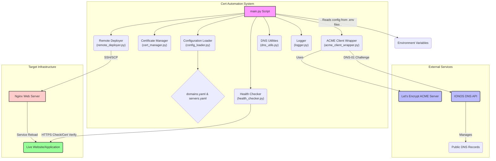

# Project Documentation: Automated SSL Certificate Renewal System

---

## 1. Overview (For Non-Technical & Executive Audiences)

### 1.1. The Problem

In today's digital landscape, SSL certificates are crucial for securing web traffic and maintaining user trust. However, these certificates have a limited lifespan and must be renewed periodically. Managing this process manually across multiple servers is:
-   **Time-Consuming**: Operators must track expiry dates and perform manual renewal and installation procedures.
-   **Error-Prone**: A missed renewal can lead to expired certificates, browser warnings, and a loss of user trust.
-   **A Security Risk**: An expired certificate can cause service downtime and create a negative perception of the organization's security posture.

### 1.2. Our Solution

This project provides a fully automated, "set-it-and-forget-it" system that handles the entire lifecycle of SSL certificates. Once configured, it operates without manual intervention to ensure that all web services remain secure and trusted.

### 1.3. Business Value

-   **Increased Security & Reliability**: Eliminates the risk of downtime caused by expired SSL certificates.
-   **Operational Efficiency**: Frees up valuable engineering and operational time by automating a repetitive, manual task.
-   **Reduced Risk**: Minimizes human error, ensuring a consistent and reliable security posture across all web-facing applications.
-   **Scalability**: Easily manages certificates for dozens or hundreds of domains and servers through simple configuration file changes.

---

## 2. Implementation Plan (From Project Inception to Completion)

This section outlines a phased implementation plan for building the Automated SSL Certificate Renewal & Deployment System from scratch, based on the requirements defined in `prd.md`.

---

### Phase 1: Core Renewal Engine & Configuration

**Objective**: To build the foundational components of the system that can issue a certificate for a single, hardcoded domain. This phase focuses on getting the core ACME logic and configuration handling in place.

| Task ID | Task Description                                                                   | Key File(s) / Component(s)                                          | Acceptance Criteria                                                                                                         |
| :------ | :--------------------------------------------------------------------------------- | :------------------------------------------------------------------ | :-------------------------------------------------------------------------------------------------------------------------- |
| **1.1**   | **Project Scaffolding & Initial Setup**                                            | `cert_automation/`, `tests/`, `.gitignore`, `requirements.txt`      | - Git repository is initialized. <br>- Project structure is created. <br>- Python dependencies are defined.                     |
| **1.2**   | **Implement Centralized Logging**                                                  | `logger.py`                                                         | - `setup_logging()` function configures logging to both console and a file. <br>- Log level is configurable via an environment variable. |
| **1.3**   | **Implement Configuration Management**                                             | `config_loader.py`, `config/*.yaml.example`, `.env.example`         | - `load_yaml_config()` can parse `domains.yaml` and `servers.yaml`. <br>- Secrets are loaded from a `.env` file.        |
| **1.4**   | **Implement Certificate Expiry Logic**                                             | `cert_manager.py`, `tests/test_cert_manager.py`                     | - `is_certificate_due_for_renewal()` correctly determines if a certificate needs renewal based on a given threshold. <br>- Unit tests pass. |
| **1.5**   | **Create `acme.sh` Wrapper**                                                       | `acme_client_wrapper.py`, `tests/test_acme_client_wrapper.py`       | - A Python wrapper can successfully execute `acme.sh` commands. <br>- It handles success, failure, and `FileNotFoundError`. <br>- Unit tests with mocking pass. |
| **1.6**   | **Integrate Core Logic in `main.py`**                                              | `main.py`                                                           | - `main.py` can orchestrate the above components to issue a certificate for a single hardcoded domain.                    |

---

### Phase 2: Secure Deployment & Service Reload

**Objective**: To extend the system to securely deploy the issued certificates to target servers and gracefully reload Nginx.

| Task ID | Task Description                                                                   | Key File(s) / Component(s)                                          | Acceptance Criteria                                                                                                         |
| :------ | :--------------------------------------------------------------------------------- | :------------------------------------------------------------------ | :-------------------------------------------------------------------------------------------------------------------------- |
| **2.1**   | **Implement Remote Deployer Module**                                               | `remote_deployer.py`, `tests/test_remote_deployer.py`               | - `RemoteDeployer` class can connect to a remote server via SSH using key-based auth. <br>- It can upload files (SCP) and execute remote commands. <br>- Unit tests with `paramiko` mocking pass. |
| **2.2**   | **Implement Nginx Validation & Reload**                                            | `remote_deployer.py`                                                | - `validate_nginx_config()` remotely executes `nginx -t` and correctly parses the result. <br>- `reload_nginx()` executes the configured reload command. |
| **2.3**   | **Implement Post-Deployment Health Checks**                                        | `health_checker.py`                                                 | - `check_https_status()` verifies the domain is reachable over HTTPS. <br>- `verify_cert_expiry()` confirms the new certificate is being served. |
| **2.4**   | **Integrate Deployment into `main.py`**                                            | `main.py`                                                           | - `main.py` now iterates through configured domains and servers. <br>- It calls `deploy_certificate` for each target. |
| **2.5**   | **Implement Rollback Mechanism**                                                   | `deploy_certificate` function in `main.py`                          | - If deployment fails, the system attempts to restore the previous certificate and reload Nginx to prevent downtime.       |

---

### Phase 3: Operational Readiness & Resilience

**Objective**: To make the system robust, portable, and ready for production use.

| Task ID | Task Description                                                                   | Key File(s) / Component(s)                                          | Acceptance Criteria                                                                                                         |
| :------ | :--------------------------------------------------------------------------------- | :------------------------------------------------------------------ | :-------------------------------------------------------------------------------------------------------------------------- |
| **3.1**   | **Implement Dry-Run Mode**                                                         | `main.py`, `acme_client_wrapper.py`, `remote_deployer.py`           | - A `--dry-run` flag simulates the entire process without making any actual changes. <br>- Includes mocking for `acme.sh` if it's not installed. |
| **3.2**   | **Implement Retry Logic (Self-Healing)**                                           | `retry_decorator.py`, applied to relevant modules                   | - A retry decorator is created to handle transient failures. <br>- It is applied to network-facing functions (API calls, SSH commands). |
| **3.3**   | **Implement Comprehensive Reporting**                                              | `report_generator.py`, `tests/test_report_generator.py`             | - A detailed Markdown report is generated after each run, summarizing successes and failures. <br>- Unit tests pass. |
| **3.4**   | **Create Dockerfile**                                                              | `Dockerfile`                                                        | - A `Dockerfile` is created that packages the application and all its dependencies (`acme.sh`, Python libraries).        |
| **3.5**   | **Create GitLab CI/CD Pipeline**                                                   | `.gitlab-ci.yml`                                                    | - The pipeline automatically builds the Docker image and runs tests. <br>- A scheduled job is configured to run the certificate renewal process. |

---

### Phase 4: Documentation & Finalization

**Objective**: To ensure the project is well-documented and easy for others to use and contribute to.

| Task ID | Task Description                                                                   | Key File(s) / Component(s)                                          | Acceptance Criteria                                                                                                         |
| :------ | :--------------------------------------------------------------------------------- | :------------------------------------------------------------------ | :-------------------------------------------------------------------------------------------------------------------------- |
| **4.1**   | **Write User & Project Documentation**                                             | `README.md`, `docs/project_documentation.md`                        | - `README.md` provides a clear overview and quick start guide. <br>- `project_documentation.md` offers comprehensive details for all audiences. |
| **4.2**   | **Write Technical & Testing Documentation**                                        | `docs/technical_deep_dive.md`, `docs/testing_strategy.md`           | - Technical deep dive explains the architecture and code. <br>- Testing strategy explains how to run and add tests.         |
| **4.3**   | **Final Code Review & Cleanup**                                                    | Entire codebase                                                     | - Code is reviewed for quality, clarity, and adherence to conventions. <br>- `.gitignore` is finalized. <br>- All project files are committed. |

---

## 3. Operator's Guide (For System Administrators & DevOps)

This section explains how to configure, run, and monitor the system.

### 3.1. How It Works

The system runs as a script that performs the following high-level steps:
1.  **Loads Configuration**: Reads your infrastructure setup from YAML files (`domains.yaml`, `servers.yaml`) and your secrets from environment variables (`.env` file).
2.  **Checks Expiry**: For each domain, it checks if the existing SSL certificate is nearing its expiration date.
3.  **Issues/Renews Certificate**: If renewal is needed, it automatically communicates with Let's Encrypt using the DNS-01 challenge method via the IONOS DNS API.
4.  **Deploys Certificate**: Securely copies the new certificate to all target servers specified for that domain.
5.  **Reloads Web Server**: Validates the web server's configuration with the new certificate and gracefully reloads it to activate the certificate without downtime.
6.  **Verifies & Reports**: Performs a health check to ensure the new certificate is active and then generates a detailed Markdown report summarizing the outcome of the entire run.

### 3.2. Getting Started

A detailed step-by-step guide is available in the main **[README.md](README.md)** file, which covers:
-   Prerequisites (Python, `acme.sh`).
-   How to install Python dependencies.
-   How to configure your `.env`, `domains.yaml`, and `servers.yaml` files.
-   How to execute the script for both live and dry runs.

### 3.3. Interpreting the Output

After each run, the system provides two key outputs:
-   **Log File (`renewal.log`)**: Contains detailed, timestamped logs of every action performed by the script. This is the primary source for in-depth troubleshooting.
-   **Markdown Report (`renewal_report.md`)**: A high-level summary of the run, designed for quick "at a glance" status checks. It clearly shows the overall status (SUCCESS, FAILURE), a summary of domains processed, and detailed information about any failures, including specific error messages.

### 3.4. Troubleshooting Common Issues

| Issue                                               | Likely Cause & Solution                                                                                                                                              |
| :-------------------------------------------------- | :------------------------------------------------------------------------------------------------------------------------------------------------------------------- |
| **"acme.sh is not installed or not in PATH"**       | The `acme.sh` dependency is missing from the system. Follow the official guide to install it. For dry runs, this error is simulated and can be ignored.                  |
| **"Missing critical environment variables"**        | The `.env` file is missing or does not contain required variables like `IONOS_API_KEY` or `ACME_EMAIL`. Ensure the `.env` file is correctly configured.                   |
| **"SSH connection to ... failed"**                  | - The SSH key is incorrect or not authorized on the target server. <br>- A firewall is blocking the connection. <br>- The host IP address or user is incorrect in `servers.yaml`. |
| **"Nginx configuration validation failed"**         | A syntax error exists in your Nginx configuration files on the remote server. SSH into the server and run `sudo nginx -t` to debug the issue.                           |
| **"Health check failed after Nginx reload"**        | The new certificate was not correctly applied by Nginx, or the web service failed to restart properly. Check the Nginx service status and logs on the remote server.      |

---

## 4. Developer's Guide (For Engineers & Contributors)

This section provides a technical overview for those looking to understand, maintain, or extend the project.

### 4.1. System Architecture & Technical Deep Dive

## 1. Introduction and Objectives

This document provides a comprehensive technical deep dive into the Automated SSL Certificate Renewal & Deployment System, building upon the requirements outlined in the Product Requirements Document (PRD). The system's core objective is to automate the entire lifecycle of SSL certificates (issuance, renewal, and deployment) for multiple Ubuntu servers, primarily using Let's Encrypt with the DNS-01 challenge, leveraging the IONOS DNS API, and deploying to Nginx web servers via SSH/SCP. The design emphasizes security, configurability, reliability, and operational readiness, supporting execution locally, via cron, or within a Dockerized CI/CD pipeline.

The system aims to address the common operational burden and security risks associated with manual SSL certificate management, offering a "set-it-and-forget-it" solution.

## 2. System Architecture

The system follows a modular architecture, orchestrated by a central Python script (`main.py`) that interacts with internal modules, external ACME clients, DNS providers, and target servers.

### 2.1. High-Level System Architecture



**Explanation:**

*   **Cert Automation System:** This represents the core Python application. `main.py` serves as the entry point, coordinating tasks across specialized modules:
    *   `config_loader.py`: Handles loading configuration from YAML files.
    *   `cert_manager.py`: Manages certificate parsing and expiry checks.
    *   `acme_client_wrapper.py`: Acts as an interface to the `acme.sh` client for certificate issuance.
    *   `remote_deployer.py`: Facilitates secure deployment to target servers via SSH/SCP.
    *   `health_checker.py`: Performs post-deployment verification checks.
    *   `dns_utils.py`: Provides utilities for DNS record propagation checks (though `acme.sh` handles this internally for its DNS-01 challenge).
    *   `logger.py`: Centralizes and manages application logging.
*   **External Services:**
    *   **Let's Encrypt ACME Server:** The Certificate Authority (CA) that issues the SSL certificates.
    *   **IONOS DNS API:** Used by `acme.sh` to programmatically create and delete DNS TXT records for the DNS-01 challenge.
    *   **Public DNS Records:** The actual DNS system where the TXT records are managed.
*   **Target Infrastructure:**
    *   **Nginx Web Server:** The server(s) where certificates are deployed and Nginx is reloaded.
    *   **Live Website/Application:** The end-user facing service whose SSL certificate is being managed.
*   **Environment Variables:** Critical parameters and secrets are loaded from environment variables, ensuring secure handling.

### 4.2. Module Breakdown and Functionality

The system is composed of several Python modules, each with a distinct responsibility:

*   **`main.py`**:
    *   **Purpose:** The main entry point and orchestrator of the entire process.
    *   **Key Functions:**
        *   Loads environment variables (`.env`).
        *   Sets up logging (`logger.py`).
        *   Parses command-line arguments (e.g., `--dry-run`).
        *   Loads `domains.yaml` and `servers.yaml` via `config_loader.py`.
        *   Iterates through configured domains and coordinates renewal/deployment.
        *   Contains `get_domain_ip_type` to determine if a domain resolves to a private or public IP (influencing wildcard cert logic).
        *   Contains `deploy_certificate` which wraps `RemoteDeployer` and `HealthChecker` logic for a single server.
*   **`config_loader.py`**:
    *   **Purpose:** Provides utilities for loading YAML configuration files.
    *   **Key Functions:**
        *   `load_yaml_config(file_path)`: Safely loads and parses a YAML file, handling `FileNotFoundError` and `yaml.YAMLError`.
*   **`logger.py`**:
    *   **Purpose:** Establishes a centralized logging system for the application.
    *   **Key Functions:**
        *   `setup_logging()`: Configures a root logger to output to both console (`sys.stdout`) and a file (`renewal.log` by default). Log level is configurable via `LOG_LEVEL` environment variable.
*   **`cert_manager.py`**:
    *   **Purpose:** Handles operations related to SSL certificates, such as parsing and expiry checks.
    *   **Key Functions:**
        *   `get_certificate_expiry_date(cert_path)`: Reads a certificate file (PEM format) using `pyOpenSSL` and extracts its `Not After` (expiry) date.
        *   `is_certificate_due_for_renewal(cert_path, renewal_threshold_days)`: Determines if a certificate's expiry date is within the specified renewal threshold. (PRD S-101)
*   **`acme_client_wrapper.py`**:
    *   **Purpose:** Provides a Python wrapper around the `acme.sh` client for interacting with ACME (Let's Encrypt) servers and handling DNS-01 challenges via IONOS.
    *   **Key Functions:**
        *   `_check_acme_sh_installed()`: Verifies `acme.sh` installation.
        *   `run_acme_command(...)`: Executes generic `acme.sh` commands, capturing output and handling errors. Supports `--staging` for dry-runs.
        *   `register_acme_account(email, acme_home_dir)`: Registers an ACME account.
        *   `issue_certificate(domain, acme_home_dir, ionos_api_key, email, cert_storage_path)`: Issues or renews a certificate for a given domain using `acme.sh`. It specifies the `dns_ionos` challenge method and passes the `IONOS_API_KEY` as an environment variable (`IONOS_TOKEN`) to `acme.sh`. It also defines output paths for `fullchain.cer` and `domain.key`. (PRD S-104, uses S-102 & S-105 indirectly via `acme.sh` plugin)
*   **`ionos_dns_client.py`**:
    *   **Purpose:** Client for direct interaction with the IONOS DNS API. While the current `acme_client_wrapper.py` relies on `acme.sh`'s internal IONOS plugin, this module demonstrates how direct API interaction could be implemented for creating/deleting DNS TXT records.
    *   **Key Functions:**
        *   `IonosDnsClient.__init__()`: Initializes with `IONOS_API_KEY`.
        *   `_get_zone_id(domain)`: Retrieves the IONOS Zone ID for a given domain.
        *   `create_txt_record(...)`: Creates an `_acme-challenge` TXT record. (PRD S-102)
        *   `delete_txt_record(...)`: Deletes a specific DNS record. (PRD S-105)
*   **`remote_deployer.py`**:
    *   **Purpose:** Manages secure remote operations on target servers using SSH and SCP.
    *   **Key Functions:**
        *   `RemoteDeployer.__init__(host, user, ssh_key_path)`: Establishes an SSH connection using `paramiko`.
        *   `upload_file(local_path, remote_path)`: Securely transfers files to the remote server. (PRD S-301)
        *   `execute_command(command)`: Executes arbitrary commands on the remote server.
        *   `validate_nginx_config()`: Executes `sudo nginx -t` remotely to check Nginx configuration syntax. (PRD S-302)
        *   `reload_nginx(reload_command)`: Executes the configured Nginx reload command (e.g., `sudo systemctl reload nginx`). (PRD S-303)
*   **`dns_utils.py`**:
    *   **Purpose:** Provides utilities for checking DNS record propagation.
    *   **Key Functions:**
        *   `check_dns_propagation(domain, record_name, expected_value, timeout_seconds, interval_seconds)`: Queries public DNS resolvers (`dnspython`) to verify the propagation of a specific TXT record, including retry logic. (PRD S-103)
*   **`health_checker.py`**:
    *   **Purpose:** Performs post-deployment health checks on the deployed certificate and web service.
    *   **Key Functions:**
        *   `check_https_status(timeout)`: Makes an HTTPS request to the domain and verifies a successful HTTP status code (2xx/3xx).
        *   `verify_cert_expiry(expected_min_expiry_days)`: Connects to the live server, fetches its SSL certificate, and uses `cert_manager.get_certificate_expiry_date` to confirm the new certificate is active and valid for a sufficient period. (PRD S-304)

### 4.3. Technical Design Details

#### 4.3.1. DNS-01 Challenge with IONOS

The system primarily relies on the Let's Encrypt DNS-01 challenge for certificate validation. This is handled by the `acme.sh` client (wrapped by `acme_client_wrapper.py`).

1.  When `acme.sh` is invoked with `--dns dns_ionos`, it expects the `IONOS_TOKEN` environment variable to contain the IONOS API Key.
2.  `acme.sh` uses this key to authenticate with the IONOS DNS API and automatically create a `_acme-challenge` TXT record for the domain.
3.  `acme.sh` then polls DNS servers to verify that this record has propagated (effectively implementing the logic of `dns_utils.py` internally).
4.  Once validated by Let's Encrypt, `acme.sh` removes the TXT record via the IONOS API.

This approach offloads the intricate DNS interaction and propagation waiting to a proven tool (`acme.sh`), simplifying the Python script's role.

#### 4.3.2. Certificate Management

*   **Local Storage:** New certificates (`fullchain.cer` and `domain.key`) are stored locally in a structured manner under `CERT_BASE_PATH` (e.g., `/tmp/certs/example.com/`).
*   **Expiry Check:** `cert_manager.py` performs the expiry check based on the certificate's `Not After` field and a configurable `RENEWAL_THRESHOLD_DAYS`.

#### 4.3.3. Secure Deployment (SSH/SCP)

*   **Key-based Authentication:** `remote_deployer.py` uses `paramiko` for SSH connections, exclusively relying on key-based authentication (`ssh_key_path`) for security, avoiding password-based methods.
*   **Atomic Deployment & Rollback:** The `deploy_certificate` function in `main.py` implements a robust deployment strategy:
    1.  **Backup:** Existing certificates on the remote server are backed up (`sudo cp`).
    2.  **Upload:** New certificates are uploaded via SCP (`upload_file`).
    3.  **Validation:** `sudo nginx -t` is executed to validate Nginx configuration with the new certificates.
    4.  **Reload:** If valid, Nginx is reloaded.
    5.  **Health Check:** Post-deployment checks ensure service integrity.
    6.  **Rollback:** If validation, reload, or health checks fail, the system attempts to restore the backup certificates and reload Nginx, minimizing downtime.
    7.  **Cleanup:** On successful deployment, backups are removed.

#### 4.3.4. Post-Deployment Health Checks

`health_checker.py` ensures the integrity of the deployed certificate and service:

*   **HTTPS Status:** A simple `requests.get()` to the domain confirms the web server is responsive.
*   **Live Certificate Verification:** By establishing an `ssl` socket connection, the system fetches the *actual* certificate being served by Nginx and verifies its expiry date against expectations, confirming the new certificate is active.

### 4.4. Deployment on Ubuntu

To deploy and run the `cert_automation` system on an Ubuntu server:

1.  **Clone the Repository:**
    ```bash
    git clone https://your-repo-url/ssh-ssl-auto-renew.git
    cd ssh-ssl-auto-renew/cert_automation
    ```
2.  **Install Python Dependencies:**
    ```bash
    sudo apt update
    sudo apt install python3 python3-pip
    pip3 install -r requirements.txt
    ```
3.  **Install `acme.sh`:**
    ```bash
    curl https://get.acme.sh | sh
    # acme.sh installs itself to ~/.acme.sh by default.
    # Ensure its bin directory is in your PATH, or specify ACME_HOME_DIR in .env
    ```
4.  **Prepare Configuration Files:**
    *   Copy `config/domains.yaml.example` to `config/domains.yaml`.
    *   Copy `config/servers.yaml.example` to `config/servers.yaml`.
    *   Edit these files with your specific domains and server details. Ensure `ssh_key_path` points to the correct location of your automation SSH key.
5.  **Set Environment Variables:**
    *   Create a `.env` file in the `cert_automation/` directory.
    *   Populate it with your sensitive data and configuration:
        ```env
        IONOS_API_KEY="your_ionos_api_key"
        ACME_EMAIL="your-letsencrypt-email@example.com"
        RENEWAL_THRESHOLD_DAYS="30"
        ACME_HOME_DIR="/root/.acme.sh" # Adjust if acme.sh is installed elsewhere
        CERT_BASE_PATH="/var/lib/cert-automation/certs" # Ensure this directory exists and is writable
        LOG_FILE_PATH="/var/log/cert-automation/renewal.log" # Ensure writable
        ```
6.  **Configure SSH Access:**
    *   Place the private SSH key (referenced by `ssh_key_path` in `servers.yaml`) on the Ubuntu server (e.g., `/root/.ssh/automation_key`).
    *   Ensure its permissions are set correctly: `chmod 600 /root/.ssh/automation_key`.
    *   Add the corresponding public SSH key to the `~/.ssh/authorized_keys` file of the `user` specified on each target Nginx server.
7.  **Run Manually (Test):**
    ```bash
    python3 main.py --dry-run # First, always use dry-run to test configuration
    python3 main.py          # Actual run
    ```
8.  **Schedule with Cron (S-402):**
    *   Edit your crontab: `crontab -e`
    *   Add an entry like the one in `cron.example` (adjust paths):
        ```cron
        # Run daily at 3 AM UTC
        0 3 * * * cd /path/to/ssh-ssl-auto-renew/cert_automation && /usr/bin/python3 main.py >> /var/log/cert-automation/cron.log 2>&1
        ```
        Ensure the cron environment sources your `.env` file or you explicitly export variables in the cron job. A more robust way is often to wrap it in a shell script that loads `.env`.

### 4.5. Integration with GitLab CI/CD

Integrating with GitLab CI/CD (PRD Epic 4) provides a robust, automated, and secure workflow for certificate renewal and deployment.

#### 4.5.1. Dockerfile (S-401)

The provided `Dockerfile` will be used to build a Docker image that contains all necessary dependencies (Python, `pip` packages, `acme.sh`).

```dockerfile
# Example Dockerfile content (assuming one exists in the project root or cert_automation/)
FROM python:3.9-slim-buster

# Install system dependencies
RUN apt-get update && apt-get install -y --no-install-recommends \
    curl \
    git \
    openssh-client \
    sudo \
    # Add any other system dependencies needed by acme.sh or paramiko
    && rm -rf /var/lib/apt/lists/*

# Install acme.sh
ENV ACME_HOME /root/.acme.sh
RUN curl -sL https://get.acme.sh | sh -s -- home "$ACME_HOME" --install-online-certbot # or just --install
ENV PATH="$PATH:$ACME_HOME:"

# Set working directory
WORKDIR /app

# Copy project files
COPY requirements.txt .
COPY cert_automation cert_automation/
COPY config config/

# Install python dependencies
RUN pip install --no-cache-dir -r requirements.txt

# Set up directories for certs and logs (ensure writable)
ENV CERT_BASE_PATH /app/certs
ENV LOG_FILE_PATH /app/renewal.log
RUN mkdir -p $CERT_BASE_PATH
RUN mkdir -p $(dirname $LOG_FILE_PATH)
RUN chmod -R 777 $CERT_BASE_PATH $(dirname $LOG_FILE_PATH) # Adjust permissions as needed for runtime user

# Entrypoint (optional, can also run via script in .gitlab-ci.yml)
# ENTRYPOINT ["python", "cert_automation/main.py"]
```
This Dockerfile should be built and pushed to your GitLab Container Registry.

#### 4.5.2. `.gitlab-ci.yml` Configuration

Below is an example `.gitlab-ci.yml` snippet demonstrating a scheduled job for certificate renewal.

```yaml
# .gitlab-ci.yml

stages:
  - build
  - renew

variables:
  # Define default values or make these available via GitLab CI/CD project variables
  RENEWAL_THRESHOLD_DAYS: "30"
  ACME_HOME_DIR: "/root/.acme.sh"
  CERT_BASE_PATH: "/app/certs" # Matches Dockerfile path
  LOG_FILE_PATH: "/app/renewal.log" # Matches Dockerfile path

build_image:
  stage: build
  image: docker:latest
  services:
    - docker:dind
  script:
    - docker login -u $CI_REGISTRY_USER -p $CI_REGISTRY_PASSWORD $CI_REGISTRY
    - docker build -t $CI_REGISTRY_IMAGE:$CI_COMMIT_SHA .
    - docker push $CI_REGISTRY_IMAGE:$CI_COMMIT_SHA
    - docker tag $CI_REGISTRY_IMAGE:$CI_COMMIT_SHA $CI_REGISTRY_IMAGE:latest
    - docker push $CI_REGISTRY_IMAGE:latest
  rules:
    - if: '$CI_COMMIT_BRANCH == "main"'


cert_renewal_job:
  stage: renew
  image: $CI_REGISTRY_IMAGE:latest # Use the custom Docker image
  before_script:
    # --- Critical: SSH Key Setup ---
    # Create the SSH key file from CI/CD variable and set correct permissions
    - mkdir -p /root/.ssh
    - echo "$SSH_PRIVATE_KEY_GITLAB" > /root/.ssh/automation_key
    - chmod 600 /root/.ssh/automation_key
    # Add SSH key to agent for paramiko
    - eval $(ssh-agent -s)
    - ssh-add /root/.ssh/automation_key
    # Optional: If host keys are not managed via known_hosts file, you might need this (use with caution)
    - mkdir -p ~/.ssh
    - touch ~/.ssh/known_hosts 
  script:
    - echo "Starting certificate renewal process at $(date)..."
    # --- Critical: Environment Variables from GitLab CI/CD ---
    # These variables MUST be set in GitLab project settings (Settings -> CI/CD -> Variables)
    # Mark them as Protected and Masked for security.
    - export IONOS_API_KEY="$IONOS_API_KEY_GITLAB"
    - export ACME_EMAIL="$ACME_EMAIL_GITLAB"
    
    # Run the main Python script
    - python cert_automation/main.py

    - echo "Certificate renewal process finished at $(date)."
  
  artifacts:
    paths:
      - cert_automation/renewal_report.md # Save the generated report as an artifact
      - cert_automation/renewal.log # Save the log file as an artifact
    expire_in: 1 week # Keep artifacts for a week

  rules:
    - if: '$CI_PIPELINE_SOURCE == "schedule"' # Automatically run on schedule
    - if: '$CI_COMMIT_BRANCH == "main"'
      when: manual # Allow manual execution from the 'main' branch for testing/emergency

dry_run_job:
  stage: renew
  image: $CI_REGISTRY_IMAGE:latest
  before_script:
    # Minimal SSH setup for dry-run if required by the RemoteDeployer instantiation
    - mkdir -p /root/.ssh
    - echo "$SSH_PRIVATE_KEY_GITLAB" > /root/.ssh/automation_key
    - chmod 600 /root/.ssh/automation_key
    - eval $(ssh-agent -s)
    - ssh-add /root/.ssh/automation_key
    - mkdir -p ~/.ssh && touch ~/.ssh/known_hosts
  script:
    - echo "Performing DRY RUN for certificate renewal at $(date)..."
    - export IONOS_API_KEY="$IONOS_API_KEY_GITLAB"
    - export ACME_EMAIL="$ACME_EMAIL_GITLAB"
    - python cert_automation/main.py --dry-run
    - echo "DRY RUN finished."
  artifacts:
    paths:
      - cert_automation/dry_run_renewal_report.md
      - cert_automation/dry_run_renewal.log
    expire_in: 1 day
  rules:
    - if: '$CI_COMMIT_BRANCH == "main"'
      when: manual # Only manual trigger for dry-runs
```

**GitLab CI/CD Variables (to be set in GitLab UI):**

*   `IONOS_API_KEY_GITLAB`: Your IONOS API Key (Protected, Masked)
*   `ACME_EMAIL_GITLAB`: Email for Let's Encrypt (Protected, Masked)
*   `SSH_PRIVATE_KEY_GITLAB`: The private SSH key for `automation_user` (Protected, Masked)

## 5. Appendix: Configuration Reference

### 5.1. Environment Variables (`.env`)

| Variable                 | Description                                                                                             | Default Value            |
| :----------------------- | :------------------------------------------------------------------------------------------------------ | :----------------------- |
| `IONOS_API_KEY`          | **Required.** Your API key for the IONOS account.                                                       | -                        |
| `ACME_EMAIL`             | **Required.** The email address to register with Let's Encrypt for expiry notifications.                  | -                        |
| `RENEWAL_THRESHOLD_DAYS` | *Optional.* Number of days before expiry to trigger a renewal.                                          | `30`                     |
| `ACME_HOME_DIR`          | *Optional.* Local path where `acme.sh` stores its data.                                                 | `/tmp/acme_home`         |
| `CERT_BASE_PATH`         | *Optional.* Local base directory where the script will store issued certificates.                         | `/tmp/certs`             |
| `REPORT_FILE_PATH`       | *Optional.* Path where the Markdown report will be saved.                                               | `renewal_report.md`      |
| `LOG_FILE_PATH`          | *Optional.* Path for the detailed script execution log file.                                            | `renewal.log`            |
| `LOG_LEVEL`              | *Optional.* Logging verbosity (`INFO`, `DEBUG`, `WARNING`, `ERROR`).                                    | `INFO`                   |

### 5.2. `domains.yaml` Structure

This file maps domains to the servers where their certificates should be deployed.

```yaml
domains:
  - domain: example.com
    servers:
      - webserver-01 # Must match a 'name' in servers.yaml
      - webserver-02
  
  - domain: private.example.com
    servers:
      - webserver-01
```

### 5.3. `servers.yaml` Structure

This file defines the connection details and commands for each target server.

```yaml
servers:
  - name: webserver-01
    host: 192.168.1.101 # IP address or resolvable hostname
    user: automation_user # User for SSH connection
    ssh_key_path: "/path/to/local/ssh/keys/automation_key" # Path to the SSH private key on the machine running the script
    nginx_reload_command: "sudo systemctl reload nginx" # Command to reload Nginx
    cert_path: "/etc/nginx/ssl" # Remote path on the target server to deploy certificates
```

---

## 6. Testing Strategy

This section outlines the testing strategy for the `cert_automation` project, including how to set up the environment, run tests, and the overall approach to ensuring code quality and reliability.

### 6.1. Testing Framework

The project uses the **pytest** framework for writing and running tests. `pytest` is a mature, feature-rich testing framework for Python that makes it easy to write small, readable tests, and can scale to support complex functional testing.

We also use the **pytest-mock** plugin, which provides a simple `mocker` fixture to mock objects and behaviors, allowing us to test functions in isolation and simulate external dependencies.

### 6.2. Testing Approach

The testing strategy is centered around **unit tests with extensive mocking**. Given that the application's core function is to interact with external services (Let's Encrypt via `acme.sh`, IONOS DNS API, remote SSH servers), it is impractical and unreliable to run tests against live systems in an automated testing environment.

The key principles are:
1.  **Isolate Logic**: Each module's internal logic is tested independently.
2.  **Mock External Dependencies**: All interactions with external systems are mocked. This includes:
    -   `subprocess.run` calls to `acme.sh`.
    -   `requests` calls to the IONOS DNS API.
    -   `paramiko` SSH/SCP connections and commands.
3.  **Test Both Success and Failure Paths**: Tests are written to cover both expected successful outcomes and various failure scenarios (e.g., API errors, non-zero exit codes from commands, failed deployments).
4.  **Self-Contained Tests**: Tests for pure logic (like `report_generator.py`) and those that can use fixtures (like `cert_manager.py` with a dummy certificate) are self-contained and do not require external configuration.

### 6.3. Test Suite Structure

All test files are located in the `tests/` directory and follow the naming convention `test_*.py`.

-   `tests/test_cert_manager.py`:
    -   **Purpose**: Tests the logic for parsing certificate files and checking their expiry dates.
    -   **Method**: Uses a pytest fixture to generate a real, temporary self-signed certificate on the fly. It then tests the parsing and date comparison logic against this known certificate.

-   `tests/test_report_generator.py`:
    -   **Purpose**: Tests the generation of the final Markdown report.
    -   **Method**: Uses pytest fixtures to create mock `results` dictionaries representing various scenarios (full success, partial failure, etc.). It then asserts that the generated Markdown string contains the expected headers, summaries, and detailed error messages.

-   `tests/test_acme_client_wrapper.py`:
    -   **Purpose**: Tests the wrapper around the `acme.sh` command-line tool.
    -   **Method**: Uses the `mocker` fixture to patch `subprocess.run`. This allows simulating `acme.sh`'s behavior, including successful execution, `CalledProcessError` (for non-zero exit codes), and `FileNotFoundError`. It also tests the retry logic by providing a sequence of failing and successful side effects to the mock.

-   `tests/test_remote_deployer.py`:
    -   **Purpose**: Tests the module responsible for SSH/SCP connections and remote command execution.
    -   **Method**: Uses the `mocker` fixture to patch the entire `paramiko` library. This allows simulating SSH connections, file uploads, and command executions without any actual network traffic. Tests verify that the correct `paramiko` methods are called with the expected arguments and that both success and failure paths are handled correctly.

### 6.4. How to Run Tests

#### 1. Setup

First, ensure you have navigated to the `cert_automation/` directory and installed all dependencies, including the testing libraries:

```bash
cd cert_automation
pip3 install -r requirements.txt
```
This will install `pytest` and `pytest-mock` along with the other project dependencies.

#### 2. Running All Tests

To run the entire test suite, simply execute the `pytest` command from the project's root directory:

```bash
pytest
```
`pytest` will automatically discover and run all files named `test_*.py` or `*_test.py` in the current directory and its subdirectories.

#### 3. Running Specific Tests

You can run tests for a specific file or even a specific test function.

```bash
# Run all tests in a specific file
pytest tests/test_remote_deployer.py

# Run a specific test function within a file
pytest tests/test_remote_deployer.py::test_validate_nginx_config_success

# Run tests using a keyword expression
pytest -k "nginx" # Runs all tests with "nginx" in their name
```

#### 4. Verbose Output

For more detailed output, use the `-v` flag:

```bash
pytest -v
```
This will show the status of each individual test function.
