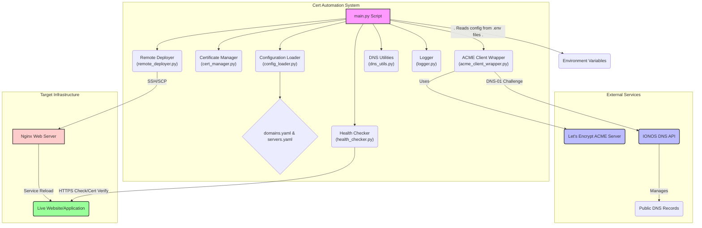

# Technical Deep Dive: Automated SSL Certificate Renewal & Deployment System

## 1. Introduction and Objectives

This document provides a comprehensive technical deep dive into the Automated SSL Certificate Renewal & Deployment System, building upon the requirements outlined in the Product Requirements Document (PRD). The system's core objective is to automate the entire lifecycle of SSL certificates (issuance, renewal, and deployment) for multiple Ubuntu servers, primarily using Let's Encrypt with the DNS-01 challenge, leveraging the IONOS DNS API, and deploying to Nginx web servers via SSH/SCP. The design emphasizes security, configurability, reliability, and operational readiness, supporting execution locally, via cron, or within a Dockerized CI/CD pipeline.

The system aims to address the common operational burden and security risks associated with manual SSL certificate management, offering a "set-it-and-forget-it" solution.

## 2. System Architecture

The system follows a modular architecture, orchestrated by a central Python script (`main.py`) that interacts with internal modules, external ACME clients, DNS providers, and target servers.

### 2.1. High-Level System Architecture



**Explanation:**

*   **Cert Automation System:** This represents the core Python application. `main.py` serves as the entry point, coordinating tasks across specialized modules:
    *   `config_loader.py`: Handles loading configuration from YAML files.
    *   `cert_manager.py`: Manages certificate parsing and expiry checks.
    *   `acme_client_wrapper.py`: Acts as an interface to the `acme.sh` client for certificate issuance.
    *   `remote_deployer.py`: Facilitates secure deployment to target servers via SSH/SCP.
    *   `health_checker.py`: Performs post-deployment verification checks.
    *   `dns_utils.py`: Provides utilities for DNS record propagation checks (though `acme.sh` handles this internally for its DNS-01 challenge).
    *   `logger.py`: Centralizes and manages application logging.
*   **External Services:**
    *   **Let's Encrypt ACME Server:** The Certificate Authority (CA) that issues the SSL certificates.
    *   **IONOS DNS API:** Used by `acme.sh` to programmatically create and delete DNS TXT records for the DNS-01 challenge.
    *   **Public DNS Records:** The actual DNS system where the TXT records are managed.
*   **Target Infrastructure:**
    *   **Nginx Web Server:** The server(s) where certificates are deployed and Nginx is reloaded.
    *   **Live Website/Application:** The end-user facing service whose SSL certificate is being managed.
*   **Environment Variables:** Critical parameters and secrets are loaded from environment variables, ensuring secure handling.

## 3. Module Breakdown and Functionality

The system is composed of several Python modules, each with a distinct responsibility:

*   **`main.py`**:
    *   **Purpose:** The main entry point and orchestrator of the entire process.
    *   **Key Functions:**
        *   Loads environment variables (`.env`).
        *   Sets up logging (`logger.py`).
        *   Parses command-line arguments (e.g., `--dry-run`).
        *   Loads `domains.yaml` and `servers.yaml` via `config_loader.py`.
        *   Iterates through configured domains and coordinates renewal/deployment.
        *   Contains `get_domain_ip_type` to determine if a domain resolves to a private or public IP (influencing wildcard cert logic).
        *   Contains `deploy_certificate` which wraps `RemoteDeployer` and `HealthChecker` logic for a single server.
*   **`config_loader.py`**:
    *   **Purpose:** Provides utilities for loading YAML configuration files.
    *   **Key Functions:**
        *   `load_yaml_config(file_path)`: Safely loads and parses a YAML file, handling `FileNotFoundError` and `yaml.YAMLError`.
*   **`logger.py`**:
    *   **Purpose:** Establishes a centralized logging system for the application.
    *   **Key Functions:**
        *   `setup_logging()`: Configures a root logger to output to both console (`sys.stdout`) and a file (`renewal.log` by default). Log level is configurable via `LOG_LEVEL` environment variable.
*   **`cert_manager.py`**:
    *   **Purpose:** Handles operations related to SSL certificates, such as parsing and expiry checks.
    *   **Key Functions:**
        *   `get_certificate_expiry_date(cert_path)`: Reads a certificate file (PEM format) using `pyOpenSSL` and extracts its `Not After` (expiry) date.
        *   `is_certificate_due_for_renewal(cert_path, renewal_threshold_days)`: Determines if a certificate's expiry date is within the specified renewal threshold. (PRD S-101)
*   **`acme_client_wrapper.py`**:
    *   **Purpose:** Provides a Python wrapper around the `acme.sh` client for interacting with ACME (Let's Encrypt) servers and handling DNS-01 challenges via IONOS.
    *   **Key Functions:**
        *   `_check_acme_sh_installed()`: Verifies `acme.sh` installation.
        *   `run_acme_command(...)`: Executes generic `acme.sh` commands, capturing output and handling errors. Supports `--staging` for dry-runs.
        *   `register_acme_account(email, acme_home_dir)`: Registers an ACME account.
        *   `issue_certificate(domain, acme_home_dir, ionos_api_key, email, cert_storage_path)`: Issues or renews a certificate for a given domain using `acme.sh`. It specifies the `dns_ionos` challenge method and passes the `IONOS_API_KEY` as an environment variable (`IONOS_TOKEN`) to `acme.sh`. It also defines output paths for `fullchain.cer` and `domain.key`. (PRD S-104, uses S-102 & S-105 indirectly via `acme.sh` plugin)
*   **`ionos_dns_client.py`**:
    *   **Purpose:** Client for direct interaction with the IONOS DNS API. While the current `acme_client_wrapper.py` relies on `acme.sh`'s internal IONOS plugin, this module demonstrates how direct API interaction could be implemented for creating/deleting DNS TXT records.
    *   **Key Functions:**
        *   `IonosDnsClient.__init__()`: Initializes with `IONOS_API_KEY`.
        *   `_get_zone_id(domain)`: Retrieves the IONOS Zone ID for a given domain.
        *   `create_txt_record(...)`: Creates an `_acme-challenge` TXT record. (PRD S-102)
        *   `delete_txt_record(...)`: Deletes a specific DNS record. (PRD S-105)
*   **`remote_deployer.py`**:
    *   **Purpose:** Manages secure remote operations on target servers using SSH and SCP.
    *   **Key Functions:**
        *   `RemoteDeployer.__init__(host, user, ssh_key_path)`: Establishes an SSH connection using `paramiko`.
        *   `upload_file(local_path, remote_path)`: Securely transfers files to the remote server. (PRD S-301)
        *   `execute_command(command)`: Executes arbitrary commands on the remote server.
        *   `validate_nginx_config()`: Executes `sudo nginx -t` remotely to check Nginx configuration syntax. (PRD S-302)
        *   `reload_nginx(reload_command)`: Executes the configured Nginx reload command (e.g., `sudo systemctl reload nginx`). (PRD S-303)
*   **`dns_utils.py`**:
    *   **Purpose:** Provides utilities for checking DNS record propagation.
    *   **Key Functions:**
        *   `check_dns_propagation(domain, record_name, expected_value, timeout_seconds, interval_seconds)`: Queries public DNS resolvers (`dnspython`) to verify the propagation of a specific TXT record, including retry logic. (PRD S-103)
*   **`health_checker.py`**:
    *   **Purpose:** Performs post-deployment health checks on the deployed certificate and web service.
    *   **Key Functions:**
        *   `check_https_status(timeout)`: Makes an HTTPS request to the domain and verifies a successful HTTP status code (2xx/3xx).
        *   `verify_cert_expiry(expected_min_expiry_days)`: Connects to the live server, fetches its SSL certificate, and uses `cert_manager.get_certificate_expiry_date` to confirm the new certificate is active and valid for a sufficient period. (PRD S-304)

## 4. Technical Design Details

### 4.1. DNS-01 Challenge with IONOS

The system primarily relies on the Let's Encrypt DNS-01 challenge for certificate validation. This is handled by the `acme.sh` client (wrapped by `acme_client_wrapper.py`).

1.  When `acme.sh` is invoked with `--dns dns_ionos`, it expects the `IONOS_TOKEN` environment variable to contain the IONOS API Key.
2.  `acme.sh` uses this key to authenticate with the IONOS DNS API and automatically create a `_acme-challenge` TXT record for the domain.
3.  `acme.sh` then polls DNS servers to verify that this record has propagated (effectively implementing the logic of `dns_utils.py` internally).
4.  Once validated by Let's Encrypt, `acme.sh` removes the TXT record via the IONOS API.

This approach offloads the intricate DNS interaction and propagation waiting to a proven tool (`acme.sh`), simplifying the Python script's role.

### 4.2. Certificate Management

*   **Local Storage:** New certificates (`fullchain.cer` and `domain.key`) are stored locally in a structured manner under `CERT_BASE_PATH` (e.g., `/tmp/certs/example.com/`).
*   **Expiry Check:** `cert_manager.py` performs the expiry check based on the certificate's `Not After` field and a configurable `RENEWAL_THRESHOLD_DAYS`.

### 4.3. Secure Deployment (SSH/SCP)

*   **Key-based Authentication:** `remote_deployer.py` uses `paramiko` for SSH connections, exclusively relying on key-based authentication (`ssh_key_path`) for security, avoiding password-based methods.
*   **Atomic Deployment & Rollback:** The `deploy_certificate` function in `main.py` implements a robust deployment strategy:
    1.  **Backup:** Existing certificates on the remote server are backed up (`sudo cp`).
    2.  **Upload:** New certificates are uploaded via SCP (`upload_file`).
    3.  **Validation:** `sudo nginx -t` is executed to validate Nginx configuration with the new certificates.
    4.  **Reload:** If valid, Nginx is reloaded.
    5.  **Health Check:** Post-deployment checks ensure service integrity.
    6.  **Rollback:** If validation, reload, or health checks fail, the system attempts to restore the backup certificates and reload Nginx, minimizing downtime.
    7.  **Cleanup:** On successful deployment, backups are removed.

### 4.4. Post-Deployment Health Checks

`health_checker.py` ensures the integrity of the deployed certificate and service:

*   **HTTPS Status:** A simple `requests.get()` to the domain confirms the web server is responsive.
*   **Live Certificate Verification:** By establishing an `ssl` socket connection, the system fetches the *actual* certificate being served by Nginx and verifies its expiry date against expectations, confirming the new certificate is active.

## 5. Deployment on Ubuntu

To deploy and run the `cert_automation` system on an Ubuntu server:

1.  **Clone the Repository:**
    ```bash
    git clone https://your-repo-url/ssh-ssl-auto-renew.git
    cd ssh-ssl-auto-renew/cert_automation
    ```
2.  **Install Python Dependencies:**
    ```bash
    sudo apt update
    sudo apt install python3 python3-pip
    pip3 install -r requirements.txt
    ```
3.  **Install `acme.sh`:**
    ```bash
    curl https://get.acme.sh | sh
    # acme.sh installs itself to ~/.acme.sh by default.
    # Ensure its bin directory is in your PATH, or specify ACME_HOME_DIR in .env
    ```
4.  **Prepare Configuration Files:**
    *   Copy `config/domains.yaml.example` to `config/domains.yaml`.
    *   Copy `config/servers.yaml.example` to `config/servers.yaml`.
    *   Edit these files with your specific domains and server details. Ensure `ssh_key_path` points to the correct location of your automation SSH key.
5.  **Set Environment Variables:**
    *   Create a `.env` file in the `cert_automation/` directory.
    *   Populate it with your sensitive data and configuration:
        ```env
        IONOS_API_KEY="your_ionos_api_key"
        ACME_EMAIL="your-letsencrypt-email@example.com"
        RENEWAL_THRESHOLD_DAYS="30"
        ACME_HOME_DIR="/root/.acme.sh" # Adjust if acme.sh is installed elsewhere
        CERT_BASE_PATH="/var/lib/cert-automation/certs" # Ensure this directory exists and is writable
        LOG_FILE_PATH="/var/log/cert-automation/renewal.log" # Ensure writable
        ```
6.  **Configure SSH Access:**
    *   Place the private SSH key (referenced by `ssh_key_path` in `servers.yaml`) on the Ubuntu server (e.g., `/root/.ssh/automation_key`).
    *   Ensure its permissions are set correctly: `chmod 600 /root/.ssh/automation_key`.
    *   Add the corresponding public SSH key to the `~/.ssh/authorized_keys` file of the `user` specified on each target Nginx server.
7.  **Run Manually (Test):**
    ```bash
    python3 main.py --dry-run # First, always use dry-run to test configuration
    python3 main.py          # Actual run
    ```
8.  **Schedule with Cron (S-402):**
    *   Edit your crontab: `crontab -e`
    *   Add an entry like the one in `cron.example` (adjust paths):
        ```cron
        # Run daily at 3 AM UTC
        0 3 * * * cd /path/to/ssh-ssl-auto-renew/cert_automation && /usr/bin/python3 main.py >> /var/log/cert-automation/cron.log 2>&1
        ```
        Ensure the cron environment sources your `.env` file or you explicitly export variables in the cron job. A more robust way is often to wrap it in a shell script that loads `.env`.

## 6. Integration with GitLab CI/CD

Integrating with GitLab CI/CD (PRD Epic 4) provides a robust, automated, and secure workflow for certificate renewal and deployment.

### 6.1. Dockerfile (S-401)

The provided `Dockerfile` will be used to build a Docker image that contains all necessary dependencies (Python, `pip` packages, `acme.sh`).

```dockerfile
# Example Dockerfile content (assuming one exists in the project root or cert_automation/)
FROM python:3.9-slim-buster

# Install system dependencies
RUN apt-get update && apt-get install -y --no-install-recommends \
    curl \
    git \
    openssh-client \
    sudo \
    # Add any other system dependencies needed by acme.sh or paramiko
    && rm -rf /var/lib/apt/lists/*

# Install acme.sh
ENV ACME_HOME /root/.acme.sh
RUN curl -sL https://get.acme.sh | sh -s -- home "$ACME_HOME" --install-online-certbot # or just --install
ENV PATH="$PATH:$ACME_HOME:"

# Set working directory
WORKDIR /app

# Copy project files
COPY requirements.txt .
COPY cert_automation cert_automation/
COPY config config/

# Install python dependencies
RUN pip install --no-cache-dir -r requirements.txt

# Set up directories for certs and logs (ensure writable)
ENV CERT_BASE_PATH /app/certs
ENV LOG_FILE_PATH /app/renewal.log
RUN mkdir -p $CERT_BASE_PATH
RUN mkdir -p $(dirname $LOG_FILE_PATH)
RUN chmod -R 777 $CERT_BASE_PATH $(dirname $LOG_FILE_PATH) # Adjust permissions as needed for runtime user

# Entrypoint (optional, can also run via script in .gitlab-ci.yml)
# ENTRYPOINT ["python", "cert_automation/main.py"]
```
This Dockerfile should be built and pushed to your GitLab Container Registry.

### 6.2. `.gitlab-ci.yml` Configuration

Below is an example `.gitlab-ci.yml` snippet demonstrating a scheduled job for certificate renewal.

```yaml
# .gitlab-ci.yml

stages:
  - build
  - renew

variables:
  # Define default values or make these available via GitLab CI/CD project variables
  RENEWAL_THRESHOLD_DAYS: "30"
  ACME_HOME_DIR: "/root/.acme.sh"
  CERT_BASE_PATH: "/app/certs" # Matches Dockerfile path
  LOG_FILE_PATH: "/app/renewal.log" # Matches Dockerfile path

build_image:
  stage: build
  image: docker:latest
  services:
    - docker:dind
  script:
    - docker login -u $CI_REGISTRY_USER -p $CI_REGISTRY_PASSWORD $CI_REGISTRY
    - docker build -t $CI_REGISTRY_IMAGE:$CI_COMMIT_SHA .
    - docker push $CI_REGISTRY_IMAGE:$CI_COMMIT_SHA
    - docker tag $CI_REGISTRY_IMAGE:$CI_COMMIT_SHA $CI_REGISTRY_IMAGE:latest
    - docker push $CI_REGISTRY_IMAGE:latest
  rules:
    - if: '$CI_COMMIT_BRANCH == "main"'


cert_renewal_job:
  stage: renew
  image: $CI_REGISTRY_IMAGE:latest # Use the custom Docker image
  before_script:
    # --- Critical: SSH Key Setup ---
    # Create the SSH key file from CI/CD variable and set correct permissions
    - mkdir -p /root/.ssh
    - echo "$SSH_PRIVATE_KEY_GITLAB" > /root/.ssh/automation_key
    - chmod 600 /root/.ssh/automation_key
    # Add SSH key to agent for paramiko
    - eval $(ssh-agent -s)
    - ssh-add /root/.ssh/automation_key
    # Optional: If host keys are not managed via known_hosts file, you might need this (use with caution)
    - mkdir -p ~/.ssh
    - touch ~/.ssh/known_hosts 
  script:
    - echo "Starting certificate renewal process at $(date)..."
    # --- Critical: Environment Variables from GitLab CI/CD ---
    # These variables MUST be set in GitLab project settings (Settings -> CI/CD -> Variables)
    # Mark them as Protected and Masked for security.
    - export IONOS_API_KEY="$IONOS_API_KEY_GITLAB"
    - export ACME_EMAIL="$ACME_EMAIL_GITLAB"
    
    # Run the main Python script
    - python cert_automation/main.py

    - echo "Certificate renewal process finished at $(date)."
  
  rules:
    # This job will run based on a schedule defined in GitLab CI/CD (e.g., daily)
    - if: '$CI_PIPELINE_SOURCE == "schedule"'
    # Allow manual execution from the 'main' branch for testing or emergency renewals
    - if: '$CI_COMMIT_BRANCH == "main"'
      when: manual

dry_run_job:
  stage: renew
  image: $CI_REGISTRY_IMAGE:latest
  before_script:
    # Minimal SSH setup for dry-run if required by the RemoteDeployer instantiation
    - mkdir -p /root/.ssh
    - echo "$SSH_PRIVATE_KEY_GITLAB" > /root/.ssh/automation_key
    - chmod 600 /root/.ssh/automation_key
    - eval $(ssh-agent -s)
    - ssh-add /root/.ssh/automation_key
    - mkdir -p ~/.ssh && touch ~/.ssh/known_hosts
  script:
    - echo "Performing DRY RUN for certificate renewal at $(date)..."
    - export IONOS_API_KEY="$IONOS_API_KEY_GITLAB"
    - export ACME_EMAIL="$ACME_EMAIL_GITLAB"
    - python cert_automation/main.py --dry-run
    - echo "DRY RUN finished."
  rules:
    - if: '$CI_COMMIT_BRANCH == "main"'
      when: manual # Only manual trigger for dry-runs
```

**GitLab CI/CD Variables (to be set in GitLab UI):**

*   `IONOS_API_KEY_GITLAB`: Your IONOS API Key (Protected, Masked)
*   `ACME_EMAIL_GITLAB`: Email for Let's Encrypt (Protected, Masked)
*   `SSH_PRIVATE_KEY_GITLAB`: The private SSH key for `automation_user` (Protected, Masked)

## 7. Low-Level Function Call Diagram

This sequence diagram illustrates the primary function calls and their sequence within the `main.py` script and its modules during a typical certificate renewal and deployment cycle.

```mermaid
sequenceDiagram
    participant CLI as Command Line Interface
    participant M as main.py
    participant L as config_loader.py
    participant CM as cert_manager.py
    participant AC as acme_client_wrapper.py
    participant DC as dns_utils.py
    participant RD as remote_deployer.py
    participant HC as health_checker.py
    participant IONOS as IonosDnsClient
    participant ACME_SH as acme.sh (external)
    participant NGINX as Nginx (remote)
    participant DNS as Public DNS
    participant TARGET_SERVER as Target Server (SSH)

    CLI ->> M: python main.py [--dry-run]
    M ->> M: setup_logging()
    M ->> M: load_dotenv()
    M ->> L: load_yaml_config("domains.yaml")
    M ->> L: load_yaml_config("servers.yaml")
    
    loop For each domain in domains.yaml
        M ->> M: process_domain(domain_info, ...)
        M ->> M: get_domain_ip_type(domain)
        M ->> CM: is_certificate_due_for_renewal(cert_path, threshold)
        alt If renewal is due or dry-run
            M ->> AC: register_acme_account(email, acme_home_dir)
            AC ->> ACME_SH: acme.sh --register-account -m email --home dir
            
            M ->> AC: issue_certificate(domain, ...)
            AC ->> ACME_SH: acme.sh --issue -d domain --dns dns_ionos ...
            ACME_SH ->> IONOS: (via env var IONOS_TOKEN) IONOS API calls (create TXT)
            IONOS ->> DNS: Update TXT record (_acme-challenge)
            ACME_SH -- monitors --> DNS: Check TXT record propagation
            IONOS ->> DNS: (via env var IONOS_TOKEN) IONOS API calls (delete TXT)
            ACME_SH -->> AC: Certificate files generated (fullchain.cer, domain.key)
            
            loop For each server associated with domain
                M ->> M: deploy_certificate(server_config, ...)
                M ->> RD: RemoteDeployer(host, user, ssh_key_path)
                RD ->> TARGET_SERVER: Establish SSH Connection
                RD ->> TARGET_SERVER: execute_command("sudo cp old_cert new_bak")
                RD ->> TARGET_SERVER: upload_file(local_fullchain, remote_fullchain)
                RD ->> TARGET_SERVER: upload_file(local_key, remote_key)
                
                RD ->> RD: validate_nginx_config()
                RD ->> TARGET_SERVER: execute_command("sudo nginx -t")
                alt If Nginx config valid
                    RD ->> RD: reload_nginx(reload_command)
                    RD ->> TARGET_SERVER: execute_command("sudo systemctl reload nginx")
                    RD ->> HC: HealthChecker(domain)
                    HC ->> NGINX: check_https_status() (requests.get)
                    HC ->> NGINX: verify_cert_expiry() (socket, ssl, cert_manager.get_certificate_expiry_date)
                    RD ->> TARGET_SERVER: execute_command("sudo rm old_bak")
                else Nginx config invalid
                    RD ->> TARGET_SERVER: Rollback (mv bak to live, reload Nginx)
                end
                RD ->> TARGET_SERVER: Close SSH Connection
            end
        else Certificate not due
            M -->> M: Log "Not due for renewal"
        end
    end
    M -->> CLI: Log "All domains processed."
```

## 8. Configuration and Environment Variables

The system relies heavily on external configuration for flexibility and security.

### 8.1. YAML Configuration Files (PRD Epic 2)

*   **`config/domains.yaml` (PRD S-202):** Maps domains to a list of target servers where their certificates should be deployed.
    ```yaml
    domains:
      - domain: example.com
        servers:
          - webserver-01
          - webserver-02
      - domain: private.example.com
        servers:
          - webserver-01
    ```
*   **`config/servers.yaml` (PRD S-201):** Defines the connection details and Nginx-specific commands for each target server.
    ```yaml
    servers:
      - name: webserver-01
        host: 192.168.1.101
        user: automation_user
        ssh_key_path: "/path/to/ssh/keys/automation_key" # Local path on the system running the script
        nginx_reload_command: "sudo systemctl reload nginx"
        cert_path: "/etc/nginx/ssl" # Remote path on the target server
    ```
*   **`config/ionos.yaml` (PRD S-204):** (Note: The current implementation primarily relies on `acme.sh`'s plugin to handle IONOS API interaction directly via `IONOS_TOKEN`. This file is not explicitly used by the Python code but is mentioned in the PRD. If direct `ionos_dns_client.py` calls were to be used for TXT record management, this file would specify API endpoints, TTLs, etc. For now, `acme.sh` handles the specifics through the `IONOS_TOKEN`.)

### 8.2. Environment Variables (PRD S-203)

These are crucial for storing sensitive credentials and operational parameters. They should be loaded from a `.env` file for local execution and managed as CI/CD variables in automated pipelines.

*   `IONOS_API_KEY`: API Key for IONOS DNS (used by `acme.sh` as `IONOS_TOKEN`).
*   `IONOS_API_SECRET`: (Optional, as per `ionos_dns_client.py` comment, not strictly used by `acme.sh` plugin).
*   `ACME_EMAIL`: Email address for Let's Encrypt account registration.
*   `RENEWAL_THRESHOLD_DAYS`: Number of days before expiry to trigger a certificate renewal (default: 30).
*   `ACME_HOME_DIR`: Local path where `acme.sh` stores its data (e.g., `/root/.acme.sh`).
*   `CERT_BASE_PATH`: Local base directory for storing issued certificates (e.g., `/tmp/certs`).
*   `LOG_FILE_PATH`: Path for the application's log file (e.g., `/var/log/cert-automation/renewal.log`).
*   `LOG_LEVEL`: Logging verbosity (e.g., `INFO`, `DEBUG`, `WARNING`, `ERROR`).

## 9. Error Handling and Rollback (PRD Risk Analysis)

The system is designed with robustness in mind to mitigate common risks:

*   **`config_loader.py`**: Catches file not found and YAML parsing errors, preventing crashes due to malformed configurations.
*   **`acme_client_wrapper.py`**: Catches `subprocess.CalledProcessError` from `acme.sh` commands, logging detailed stdout/stderr.
*   **`remote_deployer.py`**:
    *   Manages SSH connection failures gracefully.
    *   **Nginx Configuration Validation (PRD S-302, Risk Mitigation):** Before reloading Nginx, `validate_nginx_config()` executes `sudo nginx -t`. If this fails, the deployment to that specific server is aborted.
    *   **Automated Rollback (PRD Risk Mitigation):** In `deploy_certificate` (in `main.py`), if Nginx validation fails, or if `reload_nginx()` or `HealthChecker` fails, the system attempts to:
        1.  Move the backed-up old certificates back into place.
        2.  Attempt to reload Nginx with the old certificates.
        3.  Logs critical errors if rollback fails, indicating potential service disruption.
*   **`health_checker.py`**: Catches `requests.exceptions` and `ssl.SSLError` during HTTPS checks, providing clear error messages.
*   **Domain Isolation:** Failures during processing a single domain or deployment to a single server generally do not halt the entire script. The system logs the failure and proceeds to the next domain/server, ensuring partial deployment failures don't block the overall process. (PRD Risk: Partial deployment failure)

## 10. Logging (PRD S-403)

The `logger.py` module sets up a comprehensive logging system:

*   All events (info, debug, warning, error, critical) are timestamped.
*   Logs are output to both `sys.stdout` (for console/CI visibility) and a file (`LOG_FILE_PATH`).
*   Error messages are designed to be clear and actionable, aiding in quick diagnosis of issues.

## 11. Dry-Run Mode (PRD S-404)

The `--dry-run` command-line argument enables a simulation mode:

*   **`main.py`**: Passes the `dry_run` flag throughout the system.
*   **`acme_client_wrapper.py`**: Appends `--staging` to `acme.sh` commands, ensuring no actual production certificates are issued.
*   **`remote_deployer.py`**: Simulates SSH connections, file uploads, and command executions, logging what *would* have happened without performing actual changes. It will simulate successful Nginx validation and reload for testing the deployment logic flow.
*   **No Actual Changes:** In dry-run mode, no actual certificates are issued, DNS records are modified, or remote server configurations are changed, making it ideal for testing and validation of the entire configuration and workflow.

This detailed technical document, combined with the provided PRD and code, offers a complete understanding of the Automated SSL Certificate Renewal & Deployment System.